<div align="center">

# 🎓 UniTrack — University Academic Tracking System
### *Enterprise-Grade Relational Database Management System for Higher Education Operations*

[](https://www.mysql.com/)
[](docs/normalization.md)
[](#-database-schema--architecture)
[](#-database-schema--architecture)
[](#-database-schema--architecture)
[](#-license--academic-integrity)

<br/>

<p align="center">
  <a href="report/UniTrack_Final_Project_Report.md"><strong>🏆 Comprehensive Master Report</strong></a> •
  <a href="report/UniTrack_Final_Project_Report.html"><strong>🌐 Printable HTML Report</strong></a> •
  <a href="#-project-overview--scope"><strong>Overview</strong></a> •
  <a href="#-conceptual-er-modeling"><strong>ER Diagram</strong></a> •
  <a href="#-database-schema--architecture"><strong>Schema Blueprint</strong></a> •
  <a href="#-normalisation--relational-theory"><strong>Normalisation (3NF)</strong></a> •
  <a href="#-sql-queries--analytical-showcase"><strong>SQL Showcase (Q1–Q10)</strong></a>
</p>

---

</div>

> [!NOTE]
> **Academic Project Submission — Team 4**  
> **Project:** UniTrack — University Academic Tracking System  
> **Course:** Database Management Systems (DBMS) • Academic Year 2024–2025  
> **Target RDBMS:** MySQL 8.0+ (InnoDB Engine)  
> **Normalisation Level:** Third Normal Form (3NF)  
> **Scope:** 11 Relations • 14 Foreign Keys • 3 Semesters (Fall 2024 – Fall 2025) • 1,000 Total Rows  
> **Team Lead & Master Report Author:** Konduru Nanda Kishore Raju (`AU25UG-028`)

---

## 📑 Table of Contents

- [Project Overview & Scope](#-project-overview--scope)
  - [Problem Statement](#problem-statement)
  - [The UniTrack Solution](#the-unitrack-solution)
  - [System Modules & Business Rules](#system-modules--business-rules)
- [Repository Structure](#-repository-structure)
- [Conceptual ER Modeling](#-conceptual-er-modeling)
- [Database Schema & Architecture](#-database-schema--architecture)
  - [Relational Schema Blueprint](#relational-schema-blueprint)
  - [Data Dictionary & Constraints](#data-dictionary--constraints)
  - [Architectural Design Decisions](#architectural-design-decisions)
- [Normalisation & Relational Theory](#-normalisation--relational-theory)
  - [1NF, 2NF, and 3NF Proof](#1nf-2nf-and-3nf-proof)
  - [Functional Dependencies (Minimal Cover)](#functional-dependencies-minimal-cover)
  - [Anomaly Avoidance Matrix](#anomaly-avoidance-matrix)
- [Quick Start & Database Setup](#-quick-start--database-setup)
- [SQL Queries & Analytical Showcase (Q1–Q10)](#-sql-queries--analytical-showcase)
- [Team Contributions & Role Matrix](#-team-contributions--role-matrix)
- [License & Academic Integrity](#-license--academic-integrity)

---

## 📖 Project Overview & Scope

### Problem Statement

Colleges and universities handle dense operational data daily across disparate departments. In manual or spreadsheet-based systems, critical failure points regularly occur:
1. **Redundancy & Inconsistency:** Student and faculty details get duplicated across separate departmental files, leading to conflicting records when details change.
2. **Orphaned Records:** Course enrollments or submissions remain in the system without valid links to active courses or students.
3. **Invalid Attendance Tracking:** Attendance is recorded for students who never enrolled in that particular course offering section.
4. **Curriculum Duplication:** Re-entering course titles, credit weights, and syllabi every semester instead of maintaining a clean master catalog.

### The UniTrack Solution

**UniTrack** provides a single, centralized relational database engineered in **MySQL 8.0+** using the **InnoDB Engine**. It organizes all university operational data into **11 normalized tables** strictly conforming to **Third Normal Form (3NF)**. Through 14 engine-enforced foreign keys, surrogate primary keys, and domain constraints, the system ensures complete referential integrity, eliminates update/delete anomalies, and delivers fast business intelligence queries.

```
┌────────────────────────────────────────────────────────────────────────┐
│                        UNITRACK DATABASE ECOSYSTEM                     │
├────────────────────────────────────────────────────────────────────────┤
│ 1. Academic Hierarchy:   DEPARTMENT, PROGRAM, COURSE                   │
│ 2. Faculty & Rooms:       FACULTY, CLASSROOM                           │
│ 3. Student & Scheduling:  STUDENT, COURSE_OFFERING, ENROLLMENT         │
│ 4. Evaluation Engine:     ATTENDANCE, ASSIGNMENT, SUBMISSION           │
└────────────────────────────────────────────────────────────────────────┘
```

### System Modules & Business Rules

Each module enforces specific real-world operational rules at the database engine level:

| Module | Entities | Enforced Business Rules | Relational Mechanism |
|---|---|---|---|
| **1. Academic Hierarchy** | `DEPARTMENT`, `PROGRAM`, `COURSE` | Each department has a unique name and at most one faculty HOD. Programs belong to one department and have positive duration (`duration_years > 0`). Courses belong to a department, have unique codes, and have positive credit weights (`credits > 0`). | `PRIMARY KEY`, `UNIQUE(code)`, `CHECK`, Foreign Keys |
| **2. Faculty & Rooms** | `FACULTY`, `CLASSROOM` | Faculty have unique institutional email addresses and belong to a department. Classrooms record campus building, room number, and physical seating capacity (`capacity > 0`). | `UNIQUE(email)`, `CHECK(capacity > 0)` |
| **3. Student & Scheduling** | `STUDENT`, `COURSE_OFFERING`, `ENROLLMENT` | Students are admitted into exactly one degree program with a unique University Seat Number (`usn`). Course offerings schedule a catalog course with an instructor in a classroom for a specific term and year. Students cannot enroll in the same section twice. | `UNIQUE(usn)`, `UNIQUE(student_id, offering_id)` |
| **4. Evaluation Engine** | `ATTENDANCE`, `ASSIGNMENT`, `SUBMISSION` | Attendance is tied directly to an enrollment, preventing attendance for non-registered students; status is `Present` or `Absent`. Assignments define deadlines and positive maximum marks (`max_marks > 0`). Submissions track timestamps and score limits ($0 \le 	ext{marks} \le 	ext{max\_marks}$). | `FK(enrollment_id)`, `CHECK`, Engine Defaults |

[⬆ Return to Table of Contents](#-table-of-contents)

---

## 📁 Repository Structure

```bash
UniTrack-main/
│
├── README.md                            # Comprehensive project overview & documentation
├── .gitignore                           # Git hygiene rules
│
├── schema/
│   ├── create_tables.sql                # Complete DDL script (11 tables, PKs, FKs, CHECK, UNIQUE)
│   └── UniTrack_Logical_Design_Design_Rationale.md # Detailed logical schema design report
│
├── data/
│   └── insert_data.sql                  # Production DML script (1,000 rows across 3 terms in FK-safe order)
│
├── diagrams/
│   ├── ER_Diagram.png                   # Conceptual Peter Chen ER Diagram (authored by Melvin Jacob)
│   ├── ER_Diagram_README.md             # Conceptual ER design documentation & entity classifications
│   ├── relational_schema.png            # Relational schema architecture blueprint (PNG format)
│   ├── relational_schema.svg            # Relational schema architecture blueprint (Vector format)
│   └── UniTrack - ER Diagram.drawio     # Vector draw.io source file
│
├── docs/
│   ├── normalization.md                 # 1NF, 2NF, 3NF mathematical normalization proofs
│   ├── normalisation.sql                # Automated SQL test suite verifying normal form constraints
│   ├── requirements.md                  # Detailed system requirements analysis
│   └── readme.md                        # Master documentation index
│
├── report/
│   ├── UniTrack_Final_Project_Report.md # Comprehensive final project report (Team 4)
│   └── UniTrack_Final_Project_Report.html # Clean, printable academic HTML report
│
└── queries/
    ├── queries.sql                      # Production SQL analytics script (Queries Q1–Q10)
    ├── SQL Queries and Results.md       # Analytical query explanations, business logic, and findings
    ├── SQL Queries and Results.html     # Standalone HTML report for query analytics
    └── screenshots/                     # Live MySQL Workbench execution proofs (q1_output.png ... q10_output.png)
```

[⬆ Return to Table of Contents](#-table-of-contents)

---

## 📊 Conceptual ER Modeling

The conceptual architecture defines **11 Strong Entities**, each possessing a dedicated primary key. Many-to-many operational relationships are cleanly resolved through associative entities:
- **`STUDENT` $\longleftrightarrow$ `COURSE_OFFERING` (M:N):** Resolved by **`ENROLLMENT`** with candidate key `UNIQUE (student_id, offering_id)` to block duplicate registrations.
- **`STUDENT` $\longleftrightarrow$ `ASSIGNMENT` (M:N):** Resolved by **`SUBMISSION`**, tracking student submission timestamps and grades.
- **`ENROLLMENT` $\longrightarrow$ `ATTENDANCE` (1:M):** Daily session attendance is linked directly to student enrollment records rather than unverified students.

<p align="center">
  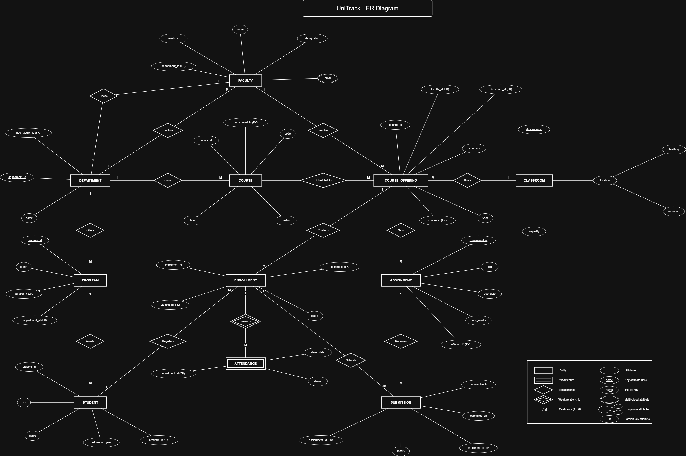
</p>

<p align="center"><em>Figure 1: Conceptual ER Diagram in Peter Chen Notation (Authored by Melvin Jacob, AU25UG-034). Editable source: <a href="diagrams/UniTrack%20-%20ER%20Diagram.drawio">UniTrack - ER Diagram.drawio</a>.</em></p>

[⬆ Return to Table of Contents](#-table-of-contents)

---

## 🗄️ Database Schema & Architecture

### Relational Schema Blueprint

<p align="center">
  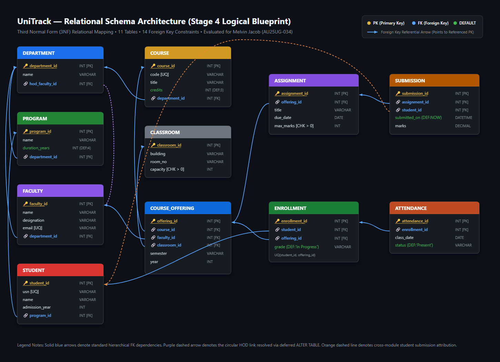
</p>

<p align="center"><em>Figure 2: Relational Schema Architecture showing all 11 tables and 14 foreign key constraints.</em></p>

### Data Dictionary & Constraints

The table below summarizes all 11 relations defined in [`schema/create_tables.sql`](schema/create_tables.sql), their key constraints, referential rules, and production dataset counts:

| # | Table Name | Primary Key | Foreign Keys & Actions | Domain Checks & Unique Keys | Verified Row Count |
|:---:|:---|:---|:---|:---|:---:|
| 1 | `DEPARTMENT` | `department_id` | `hod_faculty_id` → `FACULTY` (`SET NULL`, `CASCADE`) | `name` NOT NULL, `UNIQUE(hod_faculty_id)` | **5** |
| 2 | `PROGRAM` | `program_id` | `department_id` → `DEPARTMENT` (`RESTRICT`, `CASCADE`) | `duration_years > 0` (Default: 4) | **8** |
| 3 | `FACULTY` | `faculty_id` | `department_id` → `DEPARTMENT` (`RESTRICT`, `CASCADE`) | `email` UNIQUE, `name` NOT NULL | **20** |
| 4 | `COURSE` | `course_id` | `department_id` → `DEPARTMENT` (`RESTRICT`, `CASCADE`) | `code` UNIQUE, `credits > 0` (Default: 3) | **25** |
| 5 | `CLASSROOM` | `classroom_id` | *None (Master Asset)* | `capacity > 0`, `building`, `room_no` | **10** |
| 6 | `STUDENT` | `student_id` | `program_id` → `PROGRAM` (`RESTRICT`, `CASCADE`) | `usn` UNIQUE, `name`, `admission_year` | **100** |
| 7 | `COURSE_OFFERING` | `offering_id` | `course_id` → `COURSE`<br/>`faculty_id` → `FACULTY`<br/>`classroom_id` → `CLASSROOM` (`RESTRICT`) | `semester`, `year` NOT NULL | **30** |
| 8 | `ENROLLMENT` | `enrollment_id` | `student_id` → `STUDENT`<br/>`offering_id` → `COURSE_OFFERING` (`RESTRICT`) | `UNIQUE(student_id, offering_id)`<br/>`grade` Default: `'In Progress'` | **250** |
| 9 | `ATTENDANCE` | `attendance_id` | `enrollment_id` → `ENROLLMENT` (`CASCADE`, `CASCADE`) | `status` IN ('Present', 'Absent')<br/>`class_date` NOT NULL | **400** |
| 10 | `ASSIGNMENT` | `assignment_id` | `offering_id` → `COURSE_OFFERING` (`RESTRICT`, `CASCADE`) | `max_marks > 0`, `title`, `due_date` | **50** |
| 11 | `SUBMISSION` | `submission_id` | `assignment_id` → `ASSIGNMENT`<br/>`student_id` → `STUDENT` (`RESTRICT`, `CASCADE`) | `marks` DECIMAL(5,2)<br/>`submitted_on` Default: CURRENT_TIMESTAMP | **102** |
| | **TOTAL** | | **14 Foreign Keys** | **Zero Anomalies** | **1,000 Rows** |

### Architectural Design Decisions

1. **Resolution of Circular Dependency (`DEPARTMENT` $\longleftrightarrow$ `FACULTY`):**
   - *Challenge:* `DEPARTMENT` references `FACULTY` for its HOD, while `FACULTY` requires `department_id` referencing `DEPARTMENT`.
   - *Solution:* `DEPARTMENT` is created first with `hod_faculty_id INT NULL`. Then `FACULTY` is created with a mandatory foreign key referencing `DEPARTMENT`. Finally, an `ALTER TABLE DEPARTMENT ADD CONSTRAINT fk_dept_hod FOREIGN KEY (hod_faculty_id) REFERENCES FACULTY(faculty_id) ON DELETE SET NULL` links the HOD cleanly. During seeding, departments are inserted with `NULL`, faculty members are inserted, and HODs are assigned via clean `UPDATE` statements without disabling foreign key checks.
2. **Surrogate Keys vs. Natural Keys:**
   - Every entity uses an integer surrogate primary key (`INT PRIMARY KEY`) for compact B-tree indexing and fast join execution, while domain keys (`usn`, `code`, `email`) are protected by explicit `UNIQUE` constraints.
3. **Separating Course Catalog from Semester Offerings:**
   - Static course properties (`COURSE`: code, title, credits) are decoupled from semester-specific classes (`COURSE_OFFERING`: faculty, classroom, term, year), eliminating repetition and update anomalies across academic years.
4. **Attendance Linked via Enrollment:**
   - `ATTENDANCE` references `enrollment_id` rather than raw student and course IDs. This guarantees at the relational level that attendance can only be recorded for students who have an active course registration.

[⬆ Return to Table of Contents](#-table-of-contents)

---

## 📐 Normalisation & Relational Theory

UniTrack is mathematically verified in **Third Normal Form (3NF)** with lossless join decomposition and dependency preservation.

### 1NF, 2NF, and 3NF Proof

1. **First Normal Form (1NF):**
   - All attribute values are strictly atomic. No multi-valued attributes, lists, or repeated columns exist (e.g., student attendance dates are stored as individual rows in `ATTENDANCE`, not as comma-separated lists in `STUDENT`).
   - Every relation possesses a declared primary key.
2. **Second Normal Form (2NF):**
   - The schema satisfies 1NF.
   - Ten of the eleven relations utilize single-column primary keys, making partial functional dependencies impossible. In `ENROLLMENT`, where the natural key is composite `(student_id, offering_id)`, the non-prime attribute `grade` depends on the entire candidate key (a student receives a grade for that specific course offering).
3. **Third Normal Form (3NF):**
   - The schema satisfies 2NF.
   - No non-prime attribute transitively depends on another non-prime attribute ($X 
ightarrow Y 
ightarrow Z$). For example, `STUDENT` stores only `program_id`. Program duration and department are isolated in `PROGRAM`, eliminating the transitive dependency (`student_id → program_id → program_name`). Similarly, `COURSE_OFFERING` stores only `course_id`, isolating course credits in `COURSE`.

### Functional Dependencies (Minimal Cover)

```mathematica
DEPARTMENT:       department_id → {name, hod_faculty_id}
PROGRAM:          program_id    → {name, duration_years, department_id}
FACULTY:          faculty_id    → {name, designation, email, department_id}
                  email         → {faculty_id, name, designation, department_id}
COURSE:           course_id     → {code, title, credits, department_id}
                  code          → {course_id, title, credits, department_id}
CLASSROOM:        classroom_id  → {building, room_no, capacity}
STUDENT:          student_id    → {usn, name, admission_year, program_id}
                  usn           → {student_id, name, admission_year, program_id}
COURSE_OFFERING:  offering_id   → {course_id, faculty_id, classroom_id, semester, year}
ENROLLMENT:       enrollment_id → {student_id, offering_id, grade}
                  {student_id, offering_id} → {enrollment_id, grade}
ATTENDANCE:       attendance_id → {enrollment_id, class_date, status}
ASSIGNMENT:       assignment_id → {offering_id, title, due_date, max_marks}
SUBMISSION:       submission_id → {assignment_id, student_id, submitted_on, marks}
```

### Anomaly Avoidance Matrix

| Anomaly Type | Flat / Denormalized Flaw | UniTrack 3NF Solution |
|---|---|---|
| **Insertion Anomaly** | Cannot create a new Department or Course without having at least one enrolled Student in it. | Departments and courses are registered independently in `DEPARTMENT` and `COURSE` without needing students. |
| **Deletion Anomaly** | Deleting the last graduating student in a department wipes out the department and degree curriculum records. | Deleting a student row in `STUDENT` preserves `PROGRAM`, `DEPARTMENT`, and `COURSE` catalogs intact. |
| **Update Anomaly** | Modifying a faculty member's title requires updating hundreds of denormalized enrollment records. | Faculty title is updated once in `FACULTY`; all course offerings reflect the update immediately. |

[⬆ Return to Table of Contents](#-table-of-contents)

---

## ⚙️ Quick Start & Database Setup

### Prerequisites
- **MySQL Server 8.0+** with command-line client or **MySQL Workbench**.
- Database administrative privileges (`CREATE DATABASE`, `CREATE TABLE`).

### Native MySQL CLI Execution

```bash
# 1. Connect to MySQL Server
mysql -u root -p

# 2. Execute DDL and DML scripts in sequence
mysql> SOURCE schema/create_tables.sql;
# Output: Query OK, 11 tables created with 14 foreign keys.

mysql> SOURCE data/insert_data.sql;
# Output: Query OK, 1,000 rows inserted across 11 tables.

mysql> SOURCE queries/queries.sql;
# Output: Executes the 10 analytical business queries (Q1–Q10).
```

### Quick Verification Query

Run this query to verify table row counts in your local MySQL instance:

```sql
USE unitrack;

SELECT 'DEPARTMENT' AS `table`, COUNT(*) AS `rows` FROM DEPARTMENT
UNION ALL SELECT 'PROGRAM', COUNT(*) FROM PROGRAM
UNION ALL SELECT 'FACULTY', COUNT(*) FROM FACULTY
UNION ALL SELECT 'COURSE', COUNT(*) FROM COURSE
UNION ALL SELECT 'CLASSROOM', COUNT(*) FROM CLASSROOM
UNION ALL SELECT 'STUDENT', COUNT(*) FROM STUDENT
UNION ALL SELECT 'COURSE_OFFERING', COUNT(*) FROM COURSE_OFFERING
UNION ALL SELECT 'ENROLLMENT', COUNT(*) FROM ENROLLMENT
UNION ALL SELECT 'ATTENDANCE', COUNT(*) FROM ATTENDANCE
UNION ALL SELECT 'ASSIGNMENT', COUNT(*) FROM ASSIGNMENT
UNION ALL SELECT 'SUBMISSION', COUNT(*) FROM SUBMISSION;
```

Expected result: **11 tables, 1,000 total rows** (Attendance: 400; Submissions: 102; Enrollments: 250; Students: 100).

[⬆ Return to Table of Contents](#-table-of-contents)

---

## 🔍 SQL Queries & Analytical Showcase

The 10 verified business queries developed by **Padmaraju Poojitha (`AU25UG-043`)** demonstrate relational algebra, multi-table joins, subqueries, grouping, and aggregations:

---

### Q1. Which students are enrolled in the most courses?
* **Business Objective:** Identifies students carrying heavy workloads who may require academic advising.
* **SQL:**
```sql
SELECT s.student_id, s.usn, s.name, COUNT(*) AS course_count
FROM STUDENT s
JOIN ENROLLMENT e ON s.student_id = e.student_id
GROUP BY s.student_id, s.usn, s.name
HAVING COUNT(*) >= ALL (
    SELECT COUNT(*)
    FROM ENROLLMENT
    GROUP BY student_id
)
ORDER BY course_count DESC;
```
* **Output:**
```
+------------+---------+--------------+--------------+
| student_id | usn     | name         | course_count |
+------------+---------+--------------+--------------+
|         13 | UT22013 | Saanvi Singh |            4 |
|         15 | UT24015 | Tanvi Mishra |            4 |
|         16 | UT25016 | Varun Reddy  |            4 |
|         17 | UT22017 | Vivek Rao    |            4 |
+------------+---------+--------------+--------------+
```
<p align="center">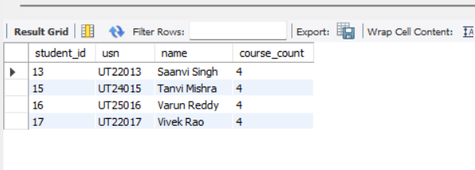</p>

* **Finding:** Exactly 4 students share the maximum course load of 4 courses each. All other students take 2 or 3 courses.

---

### Q2. Which courses have the highest enrollment?
* **Business Objective:** Highlights popular courses to help allocate larger lecture halls and additional faculty sections.
* **SQL:**
```sql
SELECT c.course_id, c.code, c.title, COUNT(*) AS enrollment_count
FROM COURSE c
JOIN COURSE_OFFERING co ON c.course_id = co.course_id
JOIN ENROLLMENT e ON co.offering_id = e.offering_id
GROUP BY c.course_id, c.code, c.title
HAVING COUNT(*) >= ALL (
    SELECT COUNT(*)
    FROM COURSE_OFFERING co2
    JOIN ENROLLMENT e2 ON co2.offering_id = e2.offering_id
    GROUP BY co2.course_id
)
ORDER BY enrollment_count DESC;
```
* **Output:**
```
+-----------+-------+-----------------------------+------------------+
| course_id | code  | title                       | enrollment_count |
+-----------+-------+-----------------------------+------------------+
|         1 | CS101 | Python Programming          |               17 |
|         3 | CS201 | Database Management Systems |               17 |
|         7 | CS301 | Algorithms                  |               17 |
|        10 | CS402 | Machine Learning            |               17 |
+-----------+-------+-----------------------------+------------------+
```
<p align="center">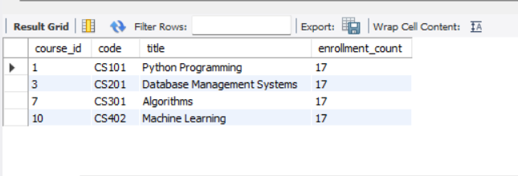</p>

* **Finding:** Core Computer Science subjects (`CS101`, `CS201`, `CS301`, `CS402`) have the highest demand, each with 17 student enrollments.

---

### Q3. Which faculty members teach the most courses?
* **Business Objective:** Audits faculty teaching allocation to ensure fair distribution of teaching responsibilities.
* **SQL:**
```sql
SELECT f.faculty_id, f.name, COUNT(*) AS courses_taught
FROM FACULTY f
JOIN COURSE_OFFERING co ON f.faculty_id = co.faculty_id
GROUP BY f.faculty_id, f.name
HAVING COUNT(*) >= ALL (
    SELECT COUNT(*)
    FROM COURSE_OFFERING
    GROUP BY faculty_id
)
ORDER BY courses_taught DESC;
```
* **Output:**
```
+------------+--------------+----------------+
| faculty_id | name         | courses_taught |
+------------+--------------+----------------+
|          1 | Amelia Patel |             14 |
+------------+--------------+----------------+
```
<p align="center">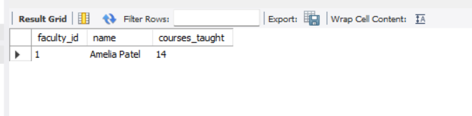</p>

* **Finding:** Faculty member **Amelia Patel** taught 14 course sections across the three semesters.

---

### Q4. What is the average grade for each course?
* **Business Objective:** Checks whether grading distribution is fair and balanced across different departments.
* **SQL:**
```sql
SELECT c.code, c.title,
ROUND(AVG(CASE e.grade
    WHEN 'A' THEN 4
    WHEN 'A-' THEN 3.7
    WHEN 'B+' THEN 3.3
    WHEN 'B' THEN 3
    WHEN 'B-' THEN 2.7
    WHEN 'C+' THEN 2.3
    WHEN 'C' THEN 2
    WHEN 'D' THEN 1
    WHEN 'F' THEN 0
END), 2) AS average_grade
FROM COURSE c
JOIN COURSE_OFFERING co ON c.course_id = co.course_id
JOIN ENROLLMENT e ON co.offering_id = e.offering_id
WHERE e.grade <> 'In Progress'
GROUP BY c.course_id, c.code, c.title
ORDER BY average_grade DESC;
```
* **Output (Sample Top & Bottom):**
```
+-------+-----------------------------+---------------+
| code  | title                       | average_grade |
+-------+-----------------------------+---------------+
| EE201 | Electrical Machines         |          3.13 |
| EE401 | Power Electronics           |          3.13 |
| ME301 | Fluid Mechanics             |          3.13 |
| CE201 | Structural Engineering      |          3.10 |
| CS301 | Algorithms                  |          3.05 |
| CS402 | Machine Learning            |          3.01 |
| ...   | (20 Completed Courses)      |           ... |
| CS204 | Software Engineering        |          2.74 |
+-------+-----------------------------+---------------+
```
<p align="center">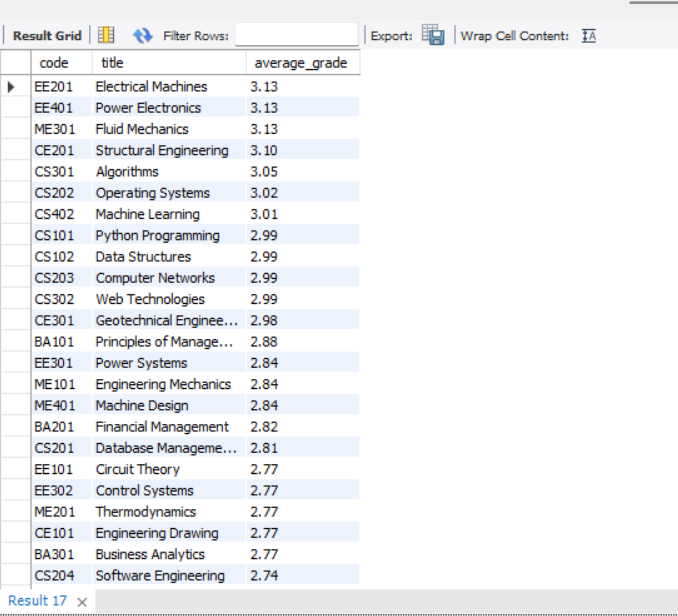</p>

* **Finding:** Course GPAs range naturally between 2.74 (`CS204`) and 3.13 (`EE201`, `EE401`, `ME301`). Ongoing terms with `'In Progress'` grades are filtered out.

---

### Q5. Which students have low attendance (< 75%)?
* **Business Objective:** Identifies students falling below the statutory 75% attendance cutoff who risk exam debarment.
* **SQL:**
```sql
SELECT s.student_id, s.usn, s.name,
ROUND(100 * SUM(a.status = 'Present') / COUNT(*), 2) AS attendance
FROM STUDENT s
JOIN ENROLLMENT e ON s.student_id = e.student_id
JOIN ATTENDANCE a ON e.enrollment_id = a.enrollment_id
GROUP BY s.student_id, s.usn, s.name
HAVING attendance < 75
ORDER BY attendance;
```
* **Output (Production Dataset):**
```
+------------+---------+---------------+----------------+-----------------+
| student_id | usn     | name          | attendance (%) | Status          |
+------------+---------+---------------+----------------+-----------------+
|         83 | UT24083 | Ananya Singh  |          33.33 | Critical (< 75%)|
|         93 | UT22093 | Saanvi Singh  |          33.33 | Critical (< 75%)|
|         98 | UT23098 | Zoya Singh    |          33.33 | Critical (< 75%)|
|         22 | UT23022 | Aditya Rao    |          40.00 | Critical (< 75%)|
|         78 | UT23078 | Zoya Singh    |          40.00 | Critical (< 75%)|
|         27 | UT24027 | Isha Rao      |          50.00 | At-Risk (< 75%) |
|         48 | UT25048 | Kavya Singh   |          50.00 | At-Risk (< 75%) |
|         13 | UT22013 | Saanvi Singh  |          57.14 | At-Risk (< 75%) |
|         15 | UT24015 | Tanvi Mishra  |          57.14 | At-Risk (< 75%) |
+------------+---------+---------------+----------------+-----------------+
```
<p align="center">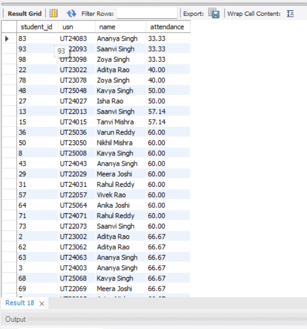</p>

* **Finding:** Enforces statutory university policy requiring $\ge 75\%$ class attendance for semester examination eligibility. Students falling below the cutoff start at **33.33%** (`Ananya Singh`, `Saanvi Singh`, `Zoya Singh`), followed by **40.00%** (`Aditya Rao`, `Zoya Singh`), **50.00%** (`Isha Rao`, `Kavya Singh`), and **57.14%** (`Saanvi Singh`, `Tanvi Mishra`), enabling timely academic counseling and intervention.

---

### Q6. Which students have not submitted an assignment?
* **Business Objective:** Pinpoints students with overdue coursework so instructors can issue deadline notices.
* **SQL:**
```sql
SELECT s.student_id, s.usn, s.name,
       a.assignment_id, a.title
FROM STUDENT s
JOIN ENROLLMENT e ON s.student_id = e.student_id
JOIN ASSIGNMENT a ON e.offering_id = a.offering_id
LEFT JOIN SUBMISSION sub
ON sub.student_id = s.student_id
AND sub.assignment_id = a.assignment_id
WHERE sub.submission_id IS NULL
ORDER BY s.student_id, a.assignment_id;
```
* **Output:**
```
+------------+---------+--------------+---------------+--------------+
| student_id | usn     | name         | assignment_id | title        |
+------------+---------+--------------+---------------+--------------+
|         91 | UT24091 | Rahul Reddy  |            42 | Assignment 2 |
|         92 | UT25092 | Riya Rao     |            12 | Assignment 4 |
|         92 | UT25092 | Riya Rao     |            13 | Assignment 1 |
|         92 | UT25092 | Riya Rao     |            27 | Assignment 3 |
|         92 | UT25092 | Riya Rao     |            42 | Assignment 2 |
|         92 | UT25092 | Riya Rao     |            43 | Assignment 3 |
|         93 | UT22093 | Saanvi Singh |            13 | Assignment 1 |
|         93 | UT22093 | Saanvi Singh |            27 | Assignment 3 |
|         93 | UT22093 | Saanvi Singh |            43 | Assignment 3 |
|         94 | UT23094 | Siddharth J. |            13 | Assignment 1 |
|        ... | ...     | ...          |           ... | ...          |
+------------+---------+--------------+---------------+--------------+
```
<p align="center">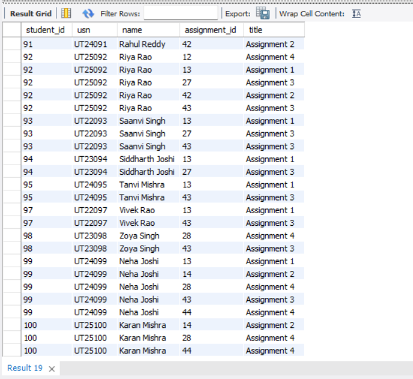</p>

* **Finding:** An anti-join (`LEFT JOIN ... WHERE sub.submission_id IS NULL`) accurately isolates all 12 deliberate unsubmitted coursework items.

---

### Q7. Which courses currently have no enrollment?
* **Business Objective:** Audits whether any course in the university syllabus is sitting unused.
* **SQL:**
```sql
SELECT c.course_id, c.code, c.title
FROM COURSE c
LEFT JOIN COURSE_OFFERING co ON c.course_id = co.course_id
LEFT JOIN ENROLLMENT e ON co.offering_id = e.offering_id
GROUP BY c.course_id, c.code, c.title
HAVING COUNT(e.enrollment_id) = 0;
```
* **Output:**
```
Empty set (0.00 sec)
```
<p align="center"></p>

* **Finding:** Returns an empty set, proving that all 25 courses in the catalog are actively offered and registered (100% syllabus utilization).

---

### Q8. Which courses have the highest average assignment marks?
* **Business Objective:** Compares student academic achievement across courses to evaluate assignment grading standards.
* **SQL:**
```sql
SELECT c.code, c.title, ROUND(AVG(s.marks), 2) AS average_marks
FROM COURSE c
JOIN COURSE_OFFERING co ON c.course_id = co.course_id
JOIN ASSIGNMENT a ON co.offering_id = a.offering_id
JOIN SUBMISSION s ON a.assignment_id = s.assignment_id
GROUP BY c.course_id, c.code, c.title
HAVING AVG(s.marks) >= ALL (
    SELECT AVG(s2.marks)
    FROM COURSE_OFFERING co2
    JOIN ASSIGNMENT a2 ON co2.offering_id = a2.offering_id
    JOIN SUBMISSION s2 ON a2.assignment_id = s2.assignment_id
    GROUP BY co2.course_id
)
ORDER BY average_marks DESC;
```
* **Output:**
```
+-------+----------------------+---------------+
| code  | title                | average_marks |
+-------+----------------------+---------------+
| BA201 | Financial Management |         24.90 |
+-------+----------------------+---------------+
```
<p align="center">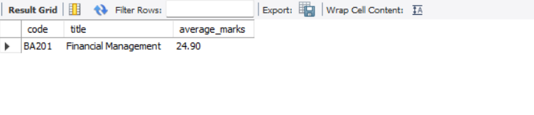</p>

* **Finding:** `BA201` (Financial Management) achieved the highest average assignment score across all offerings at **24.90 marks**.

---

### Q9. Which semester and year has the highest number of enrollments?
* **Business Objective:** Helps administrators forecast classroom space and teacher allocation for upcoming academic terms.
* **SQL:**
```sql
SELECT co.year, co.semester, COUNT(*) AS enrollment_count
FROM COURSE_OFFERING co
JOIN ENROLLMENT e ON co.offering_id = e.offering_id
GROUP BY co.year, co.semester
HAVING COUNT(*) >= ALL (
    SELECT COUNT(*)
    FROM COURSE_OFFERING co2
    JOIN ENROLLMENT e2 ON co2.offering_id = e2.offering_id
    GROUP BY co2.year, co2.semester
)
ORDER BY enrollment_count DESC;
```
* **Output:**
```
+------+----------+------------------+
| year | semester | enrollment_count |
+------+----------+------------------+
| 2024 | Fall     |              100 |
+------+----------+------------------+
```
<p align="center">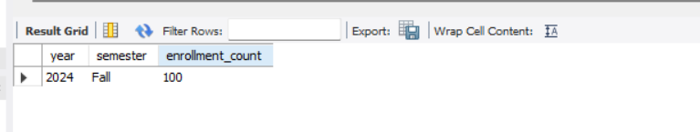</p>

* **Finding:** **Fall 2024** recorded the peak intake with 100 course enrollments (Spring 2025 had 80, Fall 2025 had 70).

---

### Q10. Which courses have the highest number of recorded absences?
* **Business Objective:** Identifies challenging subjects or early-morning lecture slots with high absenteeism rates.
* **SQL:**
```sql
SELECT c.code, c.title, COUNT(*) AS absent_count
FROM COURSE c
JOIN COURSE_OFFERING co ON c.course_id = co.course_id
JOIN ENROLLMENT e ON co.offering_id = e.offering_id
JOIN ATTENDANCE a ON e.enrollment_id = a.enrollment_id
WHERE a.status = 'Absent'
GROUP BY c.course_id, c.code, c.title
HAVING COUNT(*) >= ALL (
    SELECT COUNT(*)
    FROM COURSE_OFFERING co2
    JOIN ENROLLMENT e2 ON co2.offering_id = e2.offering_id
    JOIN ATTENDANCE a2 ON e2.enrollment_id = a2.enrollment_id
    WHERE a2.status = 'Absent'
    GROUP BY co2.course_id
)
ORDER BY absent_count DESC;
```
* **Output:**
```
+-------+-----------------------------+--------------+
| code  | title                       | absent_count |
+-------+-----------------------------+--------------+
| CS201 | Database Management Systems |            6 |
| CS402 | Machine Learning            |            6 |
+-------+-----------------------------+--------------+
```
<p align="center">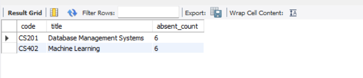</p>

* **Finding:** `CS201` (Database Management Systems) and `CS402` (Machine Learning) tied for the highest absence count with **6 recorded absences** each.

[⬆ Return to Table of Contents](#-table-of-contents)

---

## 👥 Team Contributions & Role Matrix

This project was developed by **Team 4**:

| Team Member & USN | Project Role | Core Deliverables & Responsibilities | Key Files |
|:---|:---|:---|:---|
| **Konduru Nanda Kishore Raju**<br/>`AU25UG-028` | **Team Lead & Master Report Author** | Authored the final project report, system scope, requirements analysis, architectural rationale, and conducted final project audits. | [`report/UniTrack_Final_Project_Report.md`](report/UniTrack_Final_Project_Report.md), [`report/UniTrack_Final_Project_Report.html`](report/UniTrack_Final_Project_Report.html), [`README.md`](README.md) |
| **Melvin Jacob**<br/>`AU25UG-034` | **Conceptual Modeler (ER Design)** | Conceptual Peter Chen ER model design, cardinality/participation constraints, and vector draw.io diagrams. | [`diagrams/ER_Diagram.png`](diagrams/ER_Diagram.png), [`diagrams/ER_Diagram_README.md`](diagrams/ER_Diagram_README.md) |
| **K. Jyoshna**<br/>`AU25UG-026` | **Logical Designer (DDL Engineer)** | ER-to-relational schema mapping, data dictionary, circular HOD dependency resolution, and production DDL scripts. | [`schema/create_tables.sql`](schema/create_tables.sql) |
| **Monica Irala**<br/>`AU25UG-037` | **Theory & Normalisation Lead** | Functional dependency derivation, minimal covers, 1NF/2NF/3NF mathematical proofs, and normalization SQL test suite. | [`docs/normalization.md`](docs/normalization.md), [`docs/normalisation.sql`](docs/normalisation.sql) |
| **Naidile D**<br/>`AU25UG-038` | **Database QA & DML Specialist** | Test data synthesis across 3 semesters, topological FK-safe insertion sequencing, and constraint testing. | [`data/insert_data.sql`](data/insert_data.sql) |
| **Padmaraju Poojitha**<br/>`AU25UG-043` | **Analytics & Repository Lead** | Formulated business queries Q1–Q10, query optimization, Workbench execution proofs, and GitHub repository deployment. | [`queries/queries.sql`](queries/queries.sql), [`queries/SQL Queries and Results.md`](queries/SQL%20Queries%20and%20Results.md) |

---

## 📄 License & Academic Integrity

This project is licensed for educational and academic evaluation under the **Database Management Systems Course Curriculum**. All schemas, SQL scripts, normalization proofs, and analytical query implementations represent the authentic, collaborative work of **Team 4**.
