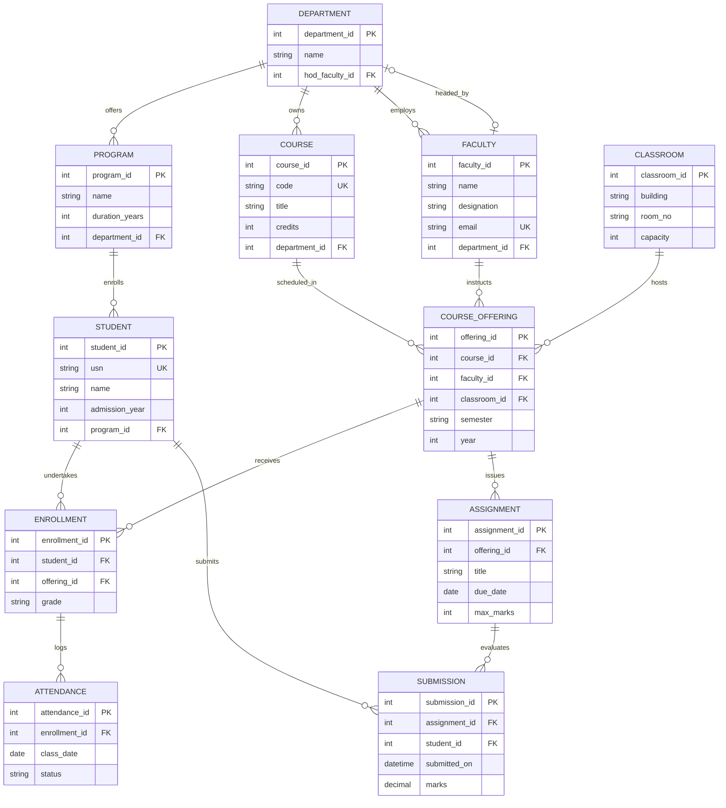

<div align="center">

# 🎓 UniTrack — University Academic Tracking System
### *Enterprise-Grade Relational Database Management System for Higher Education Operations*

[](https://www.mysql.com/)
[](docs/normalization.md)
[](#-database-schema-architecture)
[](#-sample-data-summary)
[](#-integrity-constraints--business-rules)
[](#option-c-docker-compose-environment)
[](#-license)

<br/>

<p align="center">
  <a href="#-project-overview"><strong>Explore Overview</strong></a> •
  <a href="#-interactive-er-diagram"><strong>ER Diagram</strong></a> •
  <a href="#-database-schema-architecture"><strong>Schema Blueprint</strong></a> •
  <a href="#-normalisation--functional-dependencies"><strong>Normalisation (3NF)</strong></a> •
  <a href="#-quick-start--installation"><strong>Quick Start</strong></a> •
  <a href="#-sql-queries--execution-showcase"><strong>SQL Showcase & Outputs</strong></a> •
  <a href="#-team-contributions"><strong>Team Roster</strong></a>
</p>

---

</div>

> [!NOTE]
> **Academic Project Submission — Team 4**  
> **Project:** UniTrack — Student, Course and Academic Management Database  
> **Course:** Database Management Systems (DBMS)  
> **Target RDBMS:** MySQL 8.0+ / InnoDB Engine  
> **Normalisation Level:** Third Normal Form (3NF)  
> **Total Verified Records:** ~1,000 across 3 academic semesters  
> **Team Lead:** Konduru Nanda Kishore Raju (`AU25UG-028`)

---

## 📑 Table of Contents

- [Executive Summary](#-executive-summary)
- [Project Overview & System Architecture](#-project-overview--system-architecture)
  - [Problem Statement](#problem-statement)
  - [The UniTrack Solution](#the-unitrack-solution)
  - [Domain Modules](#domain-modules)
  - [Functional Requirements Matrix](#functional-requirements-matrix)
  - [Business Rules & Assumptions](#business-rules--assumptions)
- [Repository File Structure](#-repository-file-structure)
- [Conceptual Design & ER Modeling](#-conceptual-design--er-modeling)
  - [Interactive Mermaid ER Diagram](#interactive-mermaid-er-diagram)
  - [Chen Notation ER Diagram](#chen-notation-er-diagram)
- [Database Schema Architecture](#-database-schema-architecture)
  - [Relational Schema Blueprint](#relational-schema-blueprint)
  - [Detailed Entity Specifications](#detailed-entity-specifications)
- [Relationships & Referential Integrity Matrix](#-relationships--referential-integrity-matrix)
- [Normalisation & Relational Theory](#-normalisation--relational-theory)
  - [1NF, 2NF, and 3NF Proof](#1nf-2nf-and-3nf-proof)
  - [Formal Functional Dependencies (FDs)](#formal-functional-dependencies-fds)
  - [Relational Anomaly Avoidance Matrix](#relational-anomaly-avoidance-matrix)
- [Integrity Constraints & Business Rules](#-integrity-constraints--business-rules)
- [Sample Data Architecture & Distributions](#-sample-data-architecture--distributions)
- [Quick Start & Installation](#-quick-start--installation)
  - [Prerequisites](#prerequisites)
  - [Option A: Native MySQL CLI](#option-a-native-mysql-cli-recommended)
  - [Option B: MySQL Workbench](#option-b-mysql-workbench)
  - [Option C: Docker Container Environment](#option-c-docker-container-environment)
  - [Database Verification Script](#database-verification-script)
- [SQL Queries & Execution Showcase](#-sql-queries--execution-showcase)
  - [Verified Analytical Queries (Q1–Q10) with Outputs](#verified-analytical-queries-q1q10)
- [Design Decisions & Technical Rationale](#-design-decisions--technical-rationale)
- [Team Contributions & Role Matrix](#-team-contributions--role-matrix)
- [License & Acknowledgments](#-license--acknowledgments)

---

## 🌟 Executive Summary

**UniTrack** is a production-grade, relational database solution engineered to streamline and centralize higher-education academic administration. Higher-education institutions routinely grapple with fragmented, redundant, and error-prone records spanning student lifecycle tracking, multi-departmental faculty allocations, semester-specific course offerings, continuous attendance logging, and assignment grading.

UniTrack resolves these challenges through an **Eleven-Relation Normalized Architecture (strictly conforming to Third Normal Form, 3NF)**. Designed with enterprise database engineering principles, the system guarantees:
- **Zero Update, Insertion, or Deletion Anomalies** through lossless functional decomposition.
- **Strict Referential Integrity** utilizing cascade and restrict constraints on all 14 foreign keys.
- **Circular Dependency Resolution** between `DEPARTMENT` and `FACULTY` via staged DDL execution.
- **Realistic Data Distribution** populated with ~1,000 verified rows across 3 sequential semesters (Fall 2024, Spring 2025, Fall 2025).

---

## 📖 Project Overview & System Architecture

### Problem Statement

Colleges and universities generate massive operational data streams daily. Common real-world failure points in academic record management include:
1. **Redundancy & Inconsistency:** Student and faculty contact details duplicated across multiple department spreadsheets.
2. **Orphaned Records:** Course enrollments surviving without associated students or semester offerings.
3. **Grade & Attendance Desynchronization:** Absence of unified foreign key links connecting enrollment, attendance, and assignment submissions.
4. **Uncontrolled Scheduling Conflicts:** Overlaps in faculty assignments and classroom capacities without explicit relational boundaries.

### The UniTrack Solution

UniTrack provides a single source of truth for university academic workflows. Every entity is decomposed into its atomic canonical form and reconnected via robust primary/foreign key pairs.

```
┌────────────────────────────────────────────────────────────────────────┐
│                        UNITRACK DATABASE ECOSYSTEM                     │
└───────────────────────────────────┬────────────────────────────────────┘
                                    │
    ┌───────────────────┬───────────┴───────────┬───────────────────┐
    ▼                   ▼                       ▼                   ▼
🏛️ ACADEMIC HIERARCHY  👩‍🏫 FACULTY & ROOMS      🎓 STUDENT JOURNEY  📊 EVALUATION ENGINE
• DEPARTMENT            • FACULTY               • STUDENT           • ATTENDANCE
• PROGRAM               • CLASSROOM             • COURSE_OFFERING   • ASSIGNMENT
• COURSE                • (HOD Management)      • ENROLLMENT        • SUBMISSION
```

### Domain Modules

The 11 relations in UniTrack are organized into four cohesive architectural domains:

| Domain Module | Primary Entities | Key Operational Responsibilities |
|---|---|---|
| **1. Academic Hierarchy** | `DEPARTMENT`, `PROGRAM`, `COURSE` | Structural cataloging of departments, degree programs (B.Tech, M.Tech, MBA, Ph.D), credit structures, and curriculum ownership. |
| **2. Faculty & Infrastructure** | `FACULTY`, `CLASSROOM` | Faculty profile management, HOD executive leadership appointments, physical classroom capacities, and campus building allocations. |
| **3. Student & Scheduling** | `STUDENT`, `COURSE_OFFERING`, `ENROLLMENT` | Student admissions (USN), semester timetables (Fall/Spring/Summer), faculty-to-course scheduling, and unique course registrations. |
| **4. Evaluation Engine** | `ATTENDANCE`, `ASSIGNMENT`, `SUBMISSION` | Session-by-session student attendance logging, assignment deadlines, submission timestamps, and gradebook scoring. |

### Functional Requirements Matrix

| ID | Module | Functional Requirement Specification | Enforcing Relational Table(s) | Status |
|:---:|:---|:---|:---|:---:|
| **FR-01** | Academic | Maintain university departments with unique IDs, names, and assigned HODs. | `DEPARTMENT` | ✅ Implemented |
| **FR-02** | Academic | Manage academic degree programs with explicit duration in years linked to parent departments. | `PROGRAM` | ✅ Implemented |
| **FR-03** | Faculty | Store faculty directory with designations, unique institutional emails, and department affiliations. | `FACULTY` | ✅ Implemented |
| **FR-04** | Academic | Maintain master course catalog with unique course codes, credit hours, and owning department. | `COURSE` | ✅ Implemented |
| **FR-05** | Infrastructure | Track classroom assets with building locations, room identifiers, and positive seating capacities. | `CLASSROOM` | ✅ Implemented |
| **FR-06** | Student | Register students with unique university roll numbers (USN), admission years, and program enrollments. | `STUDENT` | ✅ Implemented |
| **FR-07** | Scheduling | Schedule course offerings per academic semester with assigned instructors and physical classrooms. | `COURSE_OFFERING` | ✅ Implemented |
| **FR-08** | Student | Enroll students into specific course offerings; enforce unique single enrollment per course offering. | `ENROLLMENT` | ✅ Implemented |
| **FR-09** | Evaluation | Record daily attendance records (Present / Absent) tied strictly to valid course enrollments. | `ATTENDANCE` | ✅ Implemented |
| **FR-10** | Evaluation | Enable instructors to issue assignments with explicit submission deadlines and maximum achievable marks. | `ASSIGNMENT` | ✅ Implemented |
| **FR-11** | Evaluation | Log student submissions with precise timestamps, ensuring marks do not violate assignment parameters. | `SUBMISSION` | ✅ Implemented |

### Business Rules & Assumptions

1. **Department Leadership (1:1):** Each department has at most one faculty member acting as Head of Department (HOD) at any time. A faculty member can head at most one department.
2. **Program Affiliation (1:M):** A student is admitted into exactly one degree program throughout their study cycle.
3. **Course Offering Isolation:** A single course offering is conducted by exactly one designated faculty instructor within an assigned classroom during a specific semester and year.
4. **Unique Enrollment Invariance:** A student cannot enroll in the same course offering multiple times; this is enforced by a composite `UNIQUE (student_id, offering_id)` constraint.
5. **Discrete Attendance Model:** Attendance state is strictly categorized as `Present` or `Absent`.
6. **Academic Grade Spectrum:** Grades follow standard university evaluation scales (`A`, `B+`, `B`, `C+`, `C`) or retain `'In Progress'` for ongoing academic terms.
7. **Score Bounds:** Submissions must adhere to $0.00 \le \text{marks} \le \text{max\_marks}$.

[⬆ Return to Table of Contents](#-table-of-contents)

---

## 📁 Repository File Structure

The repository is modularized into distinct, single-responsibility directories:

```bash
UniTrack-main/
│
├── README.md                            # Comprehensive enterprise project documentation
├── .gitignore                           # Git hygiene rules (OS files, logs, temp dumps)
│
├── schema/
│   └── create_tables.sql                # Complete DDL script:
│                                        #   - Drops & creates `unitrack` database
│                                        #   - 11 CREATE TABLE statements (PKs, FKs, CHECK, UNIQUE)
│                                        #   - ALTER TABLE to cleanly resolve HOD circular FK
│
├── data/
│   └── insert_data.sql                  # Comprehensive DML script:
│                                        #   - ~1,000 verified sample records
│                                        #   - Strict FK-safe topological insertion order
│                                        #   - Covers Fall 2024, Spring 2025, Fall 2025
│
├── diagrams/
│   ├── ER_Diagram.png                   # High-resolution exported ER diagram (Chen notation)
│   ├── ER_Diagram_README.md             # Detailed conceptual ER analysis report
│   ├── relational_schema.png            # Relational schema diagram (PNG format for offline viewing)
│   ├── relational_schema.svg            # Relational schema architecture blueprint (PK/FK vector)
│   └── UniTrack - ER Diagram.drawio     # Vector draw.io source file for diagram modifications
│
├── docs/
│   ├── requirements.md                  # Stage 1: System requirements analysis & specs (Nandu)
│   ├── design_rationale.md              # Stage 4: Logical design & architectural rationale (Jyoshna)
│   ├── normalization.md                 # Stage 5: Complete 1NF → 2NF → 3NF mathematical proof report
│   ├── normalisation.sql                # Stage 5: Executable SQL test script verifying normal form proofs
│   └── readme.md                        # Master documentation index linking all student reports
│
└── queries/
    ├── README.md                        # Stage 6: Business analytics report with screenshots & explanations (Poojitha)
    ├── queries.sql                      # Production SQL analytics script (10 queries by Poojitha)
    ├── SQL Queries and Results.docx     # Formatted Microsoft Word deliverable for college report submission
    └── screenshots/                     # Verified MySQL Workbench execution screenshot outputs (Q1–Q10)
        ├── q1_output.png ... q10_output.png
```

[⬆ Return to Table of Contents](#-table-of-contents)

---

## 📊 Conceptual Design & ER Modeling

### Interactive Mermaid ER Diagram

The following diagram illustrates the complete relational entity-relationship structure natively rendered in GitHub Markdown:



### Chen Notation ER Diagram

For formal conceptual review, the university project includes the Chen notation diagram exported below:

<p align="center">
  
</p>

> 🔗 **Artifacts:**
> - Vector Source: [`diagrams/UniTrack - ER Diagram.drawio`](diagrams/UniTrack%20-%20ER%20Diagram.drawio) (Editable on [app.diagrams.net](https://app.diagrams.net/))
> - Full Conceptual Report: [`diagrams/ER_Diagram_README.md`](diagrams/ER_Diagram_README.md)

[⬆ Return to Table of Contents](#-table-of-contents)

---

## 🗄️ Database Schema Architecture

### Relational Schema Blueprint

<p align="center">
  
</p>

*Formats available:* [`diagrams/relational_schema.png`](diagrams/relational_schema.png) (High-Resolution PNG) • [`diagrams/relational_schema.svg`](diagrams/relational_schema.svg) (Scalable Vector Graphic)

The schema is defined in [`schema/create_tables.sql`](schema/create_tables.sql). Below is the structural summary of all 11 relations:

| # | Table Name | Primary Key | Foreign Keys | Key Attributes & Checks | Row Count |
|:---:|:---|:---|:---|:---|:---:|
| 1 | `DEPARTMENT` | `department_id` | `hod_faculty_id` → `FACULTY` | `name` NOT NULL | 5 |
| 2 | `PROGRAM` | `program_id` | `department_id` → `DEPARTMENT` | `duration_years` CHECK > 0 | 8 |
| 3 | `FACULTY` | `faculty_id` | `department_id` → `DEPARTMENT` | `email` UNIQUE | 20 |
| 4 | `COURSE` | `course_id` | `department_id` → `DEPARTMENT` | `code` UNIQUE, `credits` CHECK > 0 | 25 |
| 5 | `CLASSROOM` | `classroom_id` | *None* | `capacity` CHECK > 0 | 10 |
| 6 | `STUDENT` | `student_id` | `program_id` → `PROGRAM` | `usn` UNIQUE | 100 |
| 7 | `COURSE_OFFERING` | `offering_id` | `course_id`, `faculty_id`, `classroom_id` | `semester`, `year` NOT NULL | 30 |
| 8 | `ENROLLMENT` | `enrollment_id` | `student_id`, `offering_id` | `(student_id, offering_id)` UNIQUE | 250 |
| 9 | `ATTENDANCE` | `attendance_id` | `enrollment_id` → `ENROLLMENT` | `class_date`, `status` NOT NULL | 400 |
| 10 | `ASSIGNMENT` | `assignment_id` | `offering_id` → `COURSE_OFFERING` | `max_marks` CHECK > 0 | 50 |
| 11 | `SUBMISSION` | `submission_id` | `assignment_id`, `student_id` | `marks` DECIMAL(5,2) | 102 |

---

### Detailed Entity Specifications

<details open>
<summary><b>1. DEPARTMENT — Academic Departments</b></summary>
<br/>

Stores organizational departments within the institution.
- **DDL Definition:**
```sql
CREATE TABLE DEPARTMENT (
    department_id  INT AUTO_INCREMENT PRIMARY KEY,
    name           VARCHAR(100) NOT NULL,
    hod_faculty_id INT NULL
);
```
- **Attributes:**
  - `department_id` 🔑: Unique synthetic primary key.
  - `name`: Full department title (e.g., *Computer Science*).
  - `hod_faculty_id` 🔗: Self/cross-referencing FK to `FACULTY.faculty_id`. Added via `ALTER TABLE` to break circular dependency. `ON DELETE SET NULL`.
</details>

<details>
<summary><b>2. PROGRAM — Degree Programs</b></summary>
<br/>

Programs of study offered under each department.
- **DDL Definition:**
```sql
CREATE TABLE PROGRAM (
    program_id     INT PRIMARY KEY,
    name           VARCHAR(100) NOT NULL,
    duration_years INT NOT NULL DEFAULT 4,
    department_id  INT NOT NULL,
    CONSTRAINT chk_program_duration CHECK (duration_years > 0),
    CONSTRAINT fk_program_department FOREIGN KEY (department_id)
        REFERENCES DEPARTMENT(department_id) ON UPDATE CASCADE ON DELETE RESTRICT
);
```
- **Attributes:**
  - `program_id` 🔑: Primary key.
  - `name`: Degree title (e.g., *B.Tech Computer Science*, *MBA*).
  - `duration_years` 🛡️: Length of program in years; must be strictly positive (`> 0`).
  - `department_id` 🔗: Foreign key referencing owning department.
</details>

<details>
<summary><b>3. FACULTY — Academic Teaching Staff</b></summary>
<br/>

Faculty profiles, designations, and department affiliations.
- **DDL Definition:**
```sql
CREATE TABLE FACULTY (
    faculty_id    INT AUTO_INCREMENT PRIMARY KEY,
    name          VARCHAR(100) NOT NULL,
    designation   VARCHAR(100) NULL,
    email         VARCHAR(150) NULL,
    department_id INT NOT NULL,
    CONSTRAINT uq_faculty_email UNIQUE (email),
    CONSTRAINT fk_faculty_department FOREIGN KEY (department_id)
        REFERENCES DEPARTMENT(department_id) ON UPDATE CASCADE ON DELETE RESTRICT
);
```
- **Attributes:**
  - `faculty_id` 🔑: Primary key.
  - `name`: Faculty member's full name.
  - `designation`: Academic title (*Professor*, *Associate Professor*, *Assistant Professor*, *Lecturer*).
  - `email` ✨: Unique institutional email address.
  - `department_id` 🔗: Foreign key referencing parent department.
</details>

<details>
<summary><b>4. COURSE — Master Course Catalog</b></summary>
<br/>

Master curriculum course definitions.
- **DDL Definition:**
```sql
CREATE TABLE COURSE (
    course_id     INT PRIMARY KEY,
    code          VARCHAR(20)  NOT NULL UNIQUE,
    title         VARCHAR(150) NOT NULL,
    credits       INT NOT NULL DEFAULT 3,
    department_id INT NOT NULL,
    CONSTRAINT uq_course_code UNIQUE (code),
    CONSTRAINT chk_course_credits CHECK (credits > 0),
    CONSTRAINT fk_course_department FOREIGN KEY (department_id)
        REFERENCES DEPARTMENT(department_id) ON UPDATE CASCADE ON DELETE RESTRICT
);
```
- **Attributes:**
  - `course_id` 🔑: Primary key.
  - `code` ✨: Unique alphanumeric catalog code (e.g., `CS201`, `EE101`).
  - `title`: Complete course title.
  - `credits` 🛡️: Course credit hours; strictly positive.
  - `department_id` 🔗: Foreign key linking course to governing department.
</details>

<details>
<summary><b>5. CLASSROOM — Physical Campus Infrastructure</b></summary>
<br/>

Campus rooms and venue capacity parameters.
- **DDL Definition:**
```sql
CREATE TABLE CLASSROOM (
    classroom_id INT AUTO_INCREMENT PRIMARY KEY,
    building     VARCHAR(100) NOT NULL,
    room_no      VARCHAR(20)  NOT NULL,
    capacity     INT NOT NULL,
    CONSTRAINT chk_classroom_capacity CHECK (capacity > 0)
);
```
- **Attributes:**
  - `classroom_id` 🔑: Primary key.
  - `building`: Campus building name (*Main Block*, *Science Block*, *Engineering Block*).
  - `room_no`: Room number within building (*101*, *303*).
  - `capacity` 🛡️: Maximum seating capacity (`> 0`).
</details>

<details>
<summary><b>6. STUDENT — Admitted Students</b></summary>
<br/>

Student demographic and enrollment master.
- **DDL Definition:**
```sql
CREATE TABLE STUDENT (
    student_id     INT AUTO_INCREMENT PRIMARY KEY,
    usn            VARCHAR(30)  NOT NULL,
    name           VARCHAR(100) NOT NULL,
    admission_year INT NOT NULL,
    program_id     INT NOT NULL,
    CONSTRAINT uq_student_usn UNIQUE (usn),
    CONSTRAINT fk_student_program FOREIGN KEY (program_id)
        REFERENCES PROGRAM(program_id) ON UPDATE CASCADE ON DELETE RESTRICT
);
```
- **Attributes:**
  - `student_id` 🔑: Primary key.
  - `usn` ✨: University Serial Number (e.g., `UT24003`), globally unique.
  - `name`: Student's legal name.
  - `admission_year`: Calendar admission year.
  - `program_id` 🔗: Foreign key referencing active degree program.
</details>

<details>
<summary><b>7. COURSE_OFFERING — Semester Schedule Instance</b></summary>
<br/>

Binds a course, an instructor, and a classroom to a semester timetable slot.
- **DDL Definition:**
```sql
CREATE TABLE COURSE_OFFERING (
    offering_id  INT AUTO_INCREMENT PRIMARY KEY,
    course_id    INT NOT NULL,
    faculty_id   INT NOT NULL,
    classroom_id INT NOT NULL,
    semester     VARCHAR(20) NOT NULL,
    year         INT NOT NULL,
    CONSTRAINT fk_offering_course FOREIGN KEY (course_id)
        REFERENCES COURSE(course_id) ON UPDATE CASCADE ON DELETE RESTRICT,
    CONSTRAINT fk_offering_faculty FOREIGN KEY (faculty_id)
        REFERENCES FACULTY(faculty_id) ON UPDATE CASCADE ON DELETE RESTRICT,
    CONSTRAINT fk_offering_classroom FOREIGN KEY (classroom_id)
        REFERENCES CLASSROOM(classroom_id) ON UPDATE CASCADE ON DELETE RESTRICT
);
```
- **Attributes:**
  - `offering_id` 🔑: Primary key.
  - `course_id` 🔗, `faculty_id` 🔗, `classroom_id` 🔗: Triplet foreign keys.
  - `semester`: Academic term (*Fall*, *Spring*, *Summer*).
  - `year`: Calendar academic year.
</details>

<details>
<summary><b>8. ENROLLMENT — Student Course Registrations</b></summary>
<br/>

Student course registration and cumulative semester grade.
- **DDL Definition:**
```sql
CREATE TABLE ENROLLMENT (
    enrollment_id INT PRIMARY KEY,
    student_id    INT NOT NULL,
    offering_id   INT NOT NULL,
    grade         VARCHAR(20) DEFAULT 'In Progress',
    CONSTRAINT uq_student_offering UNIQUE (student_id, offering_id),
    CONSTRAINT fk_enrollment_student FOREIGN KEY (student_id)
        REFERENCES STUDENT(student_id) ON UPDATE CASCADE ON DELETE RESTRICT,
    CONSTRAINT fk_enrollment_offering FOREIGN KEY (offering_id)
        REFERENCES COURSE_OFFERING(offering_id) ON UPDATE CASCADE ON DELETE RESTRICT
);
```
- **Attributes:**
  - `enrollment_id` 🔑: Primary key.
  - `student_id` 🔗, `offering_id` 🔗: Foreign keys with composite unique index.
  - `grade`: Academic grade scored (`A`, `B+`, `B`, `C+`, `C`, or `In Progress`).
</details>

<details>
<summary><b>9. ATTENDANCE — Session Attendance Log</b></summary>
<br/>

Daily class attendance per enrolled student.
- **DDL Definition:**
```sql
CREATE TABLE ATTENDANCE (
    attendance_id INT PRIMARY KEY,
    enrollment_id INT NOT NULL,
    class_date    DATE NOT NULL,
    status        VARCHAR(20) NOT NULL DEFAULT 'Present',
    CONSTRAINT fk_attendance_enrollment FOREIGN KEY (enrollment_id)
        REFERENCES ENROLLMENT(enrollment_id) ON UPDATE CASCADE ON DELETE CASCADE
);
```
- **Attributes:**
  - `attendance_id` 🔑: Primary key.
  - `enrollment_id` 🔗: Foreign key linking to enrollment record (`ON DELETE CASCADE`).
  - `class_date`: Date of the lecture/session.
  - `status`: Attendance flag (`Present` / `Absent`).
</details>

<details>
<summary><b>10. ASSIGNMENT — Continuous Evaluation Tasks</b></summary>
<br/>

Coursework and term assignments issued by faculty.
- **DDL Definition:**
```sql
CREATE TABLE ASSIGNMENT (
    assignment_id INT AUTO_INCREMENT PRIMARY KEY,
    offering_id   INT NOT NULL,
    title         VARCHAR(150) NOT NULL,
    due_date      DATE NOT NULL,
    max_marks     INT NOT NULL,
    CONSTRAINT chk_assignment_marks CHECK (max_marks > 0),
    CONSTRAINT fk_assignment_offering FOREIGN KEY (offering_id)
        REFERENCES COURSE_OFFERING(offering_id) ON UPDATE CASCADE ON DELETE RESTRICT
);
```
- **Attributes:**
  - `assignment_id` 🔑: Primary key.
  - `offering_id` 🔗: Foreign key referencing the offering.
  - `title`: Assignment title (e.g., *Mini Project 1: ER Design*).
  - `due_date`: Strict submission deadline.
  - `max_marks` 🛡️: Maximum total marks (`> 0`).
</details>

<details>
<summary><b>11. SUBMISSION — Student Assignment Deliveries</b></summary>
<br/>

Student submissions and evaluated marks.
- **DDL Definition:**
```sql
CREATE TABLE SUBMISSION (
    submission_id INT PRIMARY KEY,
    assignment_id INT NOT NULL,
    student_id    INT NOT NULL,
    submitted_on  DATETIME DEFAULT CURRENT_TIMESTAMP,
    marks         DECIMAL(5,2) NULL,
    CONSTRAINT fk_submission_assignment FOREIGN KEY (assignment_id)
        REFERENCES ASSIGNMENT(assignment_id) ON UPDATE CASCADE ON DELETE RESTRICT,
    CONSTRAINT fk_submission_student FOREIGN KEY (student_id)
        REFERENCES STUDENT(student_id) ON UPDATE CASCADE ON DELETE RESTRICT
);
```
- **Attributes:**
  - `submission_id` 🔑: Primary key.
  - `assignment_id` 🔗: Target assignment.
  - `student_id` 🔗: Student author.
  - `submitted_on`: Timestamp of submission.
  - `marks`: Evaluated score as `DECIMAL(5,2)`.
</details>

[⬆ Return to Table of Contents](#-table-of-contents)

---

## 🔗 Relationships & Referential Integrity Matrix

UniTrack implements **14 explicit Foreign Key constraints** with strictly defined referential integrity actions:

| Relationship Name | Parent Relation (1) | Child Relation (M) | Foreign Key Column | Cardinality | ON DELETE | ON UPDATE | Real-World Business Justification |
|---|---|---|---|:---:|:---:|:---:|---|
| **Offers** | `DEPARTMENT` | `PROGRAM` | `department_id` | 1:M | RESTRICT | CASCADE | A department cannot be deleted if active academic programs depend on it. |
| **Employs** | `DEPARTMENT` | `FACULTY` | `department_id` | 1:M | RESTRICT | CASCADE | Prevents orphaned faculty records upon department updates. |
| **Owns** | `DEPARTMENT` | `COURSE` | `department_id` | 1:M | RESTRICT | CASCADE | Prevents accidental deletion of courses registered under an active department. |
| **Heads** | `FACULTY` | `DEPARTMENT` | `hod_faculty_id` | 1:1 | SET NULL | CASCADE | If an HOD resigns or is removed, the department remains intact while HOD becomes NULL. |
| **Enrolls** | `PROGRAM` | `STUDENT` | `program_id` | 1:M | RESTRICT | CASCADE | Degree programs cannot be purged while enrolled students are pursuing them. |
| **Schedules** | `COURSE` | `COURSE_OFFERING` | `course_id` | 1:M | RESTRICT | CASCADE | Preserves historical semester offerings even if course revisions occur. |
| **Instructs** | `FACULTY` | `COURSE_OFFERING` | `faculty_id` | 1:M | RESTRICT | CASCADE | Historical teaching records are locked against accidental faculty deletion. |
| **Hosts** | `CLASSROOM` | `COURSE_OFFERING` | `classroom_id` | 1:M | RESTRICT | CASCADE | Classroom facilities cannot be dropped while semester offerings are scheduled there. |
| **Registers** | `STUDENT` | `ENROLLMENT` | `student_id` | 1:M | RESTRICT | CASCADE | Student registration history cannot be deleted while enrollment ties exist. |
| **Populates** | `COURSE_OFFERING` | `ENROLLMENT` | `offering_id` | 1:M | RESTRICT | CASCADE | Course offering rosters cannot be deleted while students are enrolled. |
| **Tracks** | `ENROLLMENT` | `ATTENDANCE` | `enrollment_id` | 1:M | CASCADE | CASCADE | Deleting an enrollment cascades to purge corresponding attendance timestamps. |
| **Issues** | `COURSE_OFFERING` | `ASSIGNMENT` | `offering_id` | 1:M | RESTRICT | CASCADE | Assignments cannot be dropped if tied to an active course offering. |
| **Evaluates** | `ASSIGNMENT` | `SUBMISSION` | `assignment_id` | 1:M | RESTRICT | CASCADE | Evaluated assignment artifacts cannot be deleted without clearing submissions. |
| **Submits** | `STUDENT` | `SUBMISSION` | `student_id` | 1:M | RESTRICT | CASCADE | Student submission history is safeguarded against inadvertent student removal. |

[⬆ Return to Table of Contents](#-table-of-contents)

---

## 📐 Normalisation & Relational Theory

UniTrack is engineered from the ground up to satisfy **Third Normal Form (3NF)** with zero loss of dependencies and lossless join decomposition.

### 1NF, 2NF, and 3NF Proof

```
┌────────────────────────────────────────────────────────────────────────┐
│                   NORMALISATION HIERARCHY IN UNITRACK                  │
├────────────────────────────────────────────────────────────────────────┤
│  3NF  │ No Transitive Dependencies (X → Y, Y not subset of candidate)   │
│  2NF  │ No Partial Dependencies (No non-prime attribute on partial key)│
│  1NF  │ Atomic attribute values, unique column names, explicit PK      │
└────────────────────────────────────────────────────────────────────────┘
```

1. **First Normal Form (1NF) Compliance:**
   - **Atomicity:** All attributes contain single, atomic values. No repeating groups or comma-separated lists exist (e.g., student attendance dates are normalized into independent rows in `ATTENDANCE`, not stored as CSV arrays).
   - **Primary Keys:** Every relation possesses a declared primary key.
   - **Tuple Uniqueness:** Enforced by unique primary keys and natural unique constraints.

2. **Second Normal Form (2NF) Compliance:**
   - Relation is in 1NF.
   - **No Partial Dependencies:** Every non-prime attribute is fully functionally dependent on the entire primary key.
   - Tables with composite candidate keys, notably `ENROLLMENT(student_id, offering_id)`, maintain single non-prime attributes (`grade`) that depend on the complete combination of `student_id` AND `offering_id`, not just either attribute alone.

3. **Third Normal Form (3NF) Compliance:**
   - Relation is in 2NF.
   - **No Transitive Dependencies:** For every functional dependency $X \rightarrow Y$, either:
     - $X$ is a superkey, OR
     - $Y$ is a prime attribute (part of a candidate key).
   - *Example:* In `STUDENT`, `program_id` determines program details, but `program_name` and `duration_years` are isolated in `PROGRAM`. Storing `program_name` inside `STUDENT` would introduce a transitive dependency (`student_id → program_id → program_name`), violating 3NF. UniTrack strictly eliminates all such transitive patterns.

> 📚 **Deep Dive:** For the mathematical theorem proofs, candidate key derivations, and SQL validation queries, refer to [`docs/normalization.md`](docs/normalization.md) and [`docs/normalisation.sql`](docs/normalisation.sql).

---

### Formal Functional Dependencies (FDs)

The minimal cover of functional dependencies across the 11 relations:

```mathematica
DEPARTMENT:       department_id → {name, hod_faculty_id}
PROGRAM:          program_id    → {name, duration_years, department_id}
FACULTY:          faculty_id    → {name, designation, email, department_id}
                  email         → {faculty_id, name, designation, department_id}
COURSE:           course_id     → {code, title, credits, department_id}
                  code          → {course_id, title, credits, department_id}
CLASSROOM:        classroom_id  → {building, room_no, capacity}
STUDENT:          student_id    → {usn, name, admission_year, program_id}
                  usn           → {student_id, name, admission_year, program_id}
COURSE_OFFERING:  offering_id   → {course_id, faculty_id, classroom_id, semester, year}
ENROLLMENT:       enrollment_id → {student_id, offering_id, grade}
                  {student_id, offering_id} → {enrollment_id, grade}
ATTENDANCE:       attendance_id → {enrollment_id, class_date, status}
ASSIGNMENT:       assignment_id → {offering_id, title, due_date, max_marks}
SUBMISSION:       submission_id → {assignment_id, student_id, submitted_on, marks}
```

---

### Relational Anomaly Avoidance Matrix

The table below contrasts an un-normalized denormalized design against UniTrack's 3NF architecture:

| Anomaly Type | Un-Normalized Flat File Approach | UniTrack 3NF Normalized Solution |
|---|---|---|
| **Insertion Anomaly** | Cannot create a new Department or Course without having at least one enrolled Student enrolled in it. | Departments and Courses can be registered independently into `DEPARTMENT` and `COURSE` without requiring students or instructors. |
| **Deletion Anomaly** | Deleting the last graduating Student in a program inadvertently deletes the Department and Program catalog details. | Deleting a student in `STUDENT` only purges their personal record; the `PROGRAM` and `DEPARTMENT` records remain permanently preserved. |
| **Update Anomaly** | Changing a Faculty member's designation requires updating hundreds of denormalized enrollment records; inconsistency occurs if one is missed. | Faculty details are updated once in `FACULTY(faculty_id)`. The change automatically reflects institution-wide without data desynchronization. |

[⬆ Return to Table of Contents](#-table-of-contents)

---

## 🔒 Integrity Constraints & Business Rules

UniTrack enforces comprehensive database constraints at the RDBMS engine level:

```
┌────────────────────────────────────────────────────────────────────────┐
│                        ENGINE-ENFORCED CONSTRAINTS                     │
├────────────────────────────────────────────────────────────────────────┤
│  PRIMARY KEYS      │ 11 relations with explicit single-column PKs      │
│  FOREIGN KEYS      │ 14 referential links with CASCADE/RESTRICT/SETNULL│
│  UNIQUE INDEXES    │ COURSE.code, STUDENT.usn, FACULTY.email, ENROLLMENT│
│  CHECK CONSTRAINTS │ credits > 0, duration > 0, capacity > 0, marks > 0│
│  DEFAULT RULES     │ credits=3, duration=4, grade, status, submitted_on │
│  NOT NULL RULES    │ Enforced on all essential operational attributes   │
└────────────────────────────────────────────────────────────────────────┘
```

| Constraint Class | Table & Column | Specification / Syntax | Business Rationale |
|:---:|:---|:---|:---|
| **PRIMARY KEY** | All 11 Tables | `PRIMARY KEY (table_id)` | Guarantees entity integrity and row addressability. |
| **UNIQUE** | `COURSE(code)` | `CONSTRAINT uq_course_code UNIQUE (code)` | Prevents duplicate course codes in the university catalog. |
| **UNIQUE** | `STUDENT(usn)` | `CONSTRAINT uq_student_usn UNIQUE (usn)` | Ensures university serial numbers are globally unique. |
| **UNIQUE** | `FACULTY(email)` | `CONSTRAINT uq_faculty_email UNIQUE (email)` | Enforces unique communication handles for faculty members. |
| **UNIQUE** | `ENROLLMENT(student_id, offering_id)` | `CONSTRAINT uq_student_offering UNIQUE (...)` | Blocks duplicate registrations for the same semester offering. |
| **CHECK** | `PROGRAM(duration_years)` | `CHECK (duration_years > 0)` | Degree duration must be a realistic non-zero timespan. |
| **CHECK** | `COURSE(credits)` | `CHECK (credits > 0)` | Prevents courses from having zero or negative credits. |
| **CHECK** | `CLASSROOM(capacity)` | `CHECK (capacity > 0)` | Classroom physical seat count must be positive. |
| **CHECK** | `ASSIGNMENT(max_marks)` | `CHECK (max_marks > 0)` | Coursework assignments must possess positive maximum marks. |
| **DEFAULT** | `PROGRAM(duration_years)` | `duration_years INT NOT NULL DEFAULT 4` | Standard duration for 4-year undergraduate degree programs. |
| **DEFAULT** | `COURSE(credits)` | `credits INT NOT NULL DEFAULT 3` | Default credit weight for standard university lecture courses. |
| **DEFAULT** | `ENROLLMENT(grade)` | `grade VARCHAR(20) DEFAULT 'In Progress'` | Default status for enrolled students before semester grading closes. |
| **DEFAULT** | `ATTENDANCE(status)` | `status VARCHAR(20) NOT NULL DEFAULT 'Present'` | Fallback attendance status assuming scheduled class attendance. |
| **DEFAULT** | `SUBMISSION(submitted_on)` | `submitted_on DATETIME DEFAULT CURRENT_TIMESTAMP` | Automatic capture of student submission timestamp upon upload. |

[⬆ Return to Table of Contents](#-table-of-contents)

---

## 📊 Sample Data Architecture & Distributions

The database is pre-populated via [`data/insert_data.sql`](data/insert_data.sql) with **~1,000 verified rows** covering **three consecutive semesters**:
- **Fall 2024:** Course Offerings 1–10 (Completed term, final letter grades issued)
- **Spring 2025:** Course Offerings 11–20 (Completed term, final letter grades issued)
- **Fall 2025:** Course Offerings 21–30 (Current active term, grades marked `'In Progress'`)

### Distribution Breakdown

```
DEPARTMENT RECORDS (5)
├── Computer Science [38% of students, 10 courses]
├── Electrical Engineering [25% of students, 5 courses]
├── Mechanical Engineering [13% of students, 4 courses]
├── Civil Engineering [12% of students, 3 courses]
└── Business Administration [12% of students, 3 courses]
```

| Table Name | Exact Row Count | Primary Key Range | Notes & Data Attributes |
|:---|:---:|:---:|:---|
| `DEPARTMENT` | **5** | 1 – 5 | CS, EE, ME, CE, BA; all 5 have active HOD appointments. |
| `PROGRAM` | **8** | 1 – 8 | B.Tech (4 yrs), M.Tech (2 yrs), MBA (2 yrs), Ph.D (5 yrs). |
| `FACULTY` | **20** | 1 – 20 | 4 Professors, 6 Associate Professors, 5 Assistant Professors, 5 Lecturers. |
| `COURSE` | **25** | 1 – 25 | 10 CS, 5 EE, 4 ME, 3 CE, 3 BA courses (Credits range 3–4). |
| `CLASSROOM` | **10** | 1 – 10 | Main Block, Science Block, Engineering, Management, Innovation Blocks. |
| `STUDENT` | **100** | 1 – 100 | USNs `UT22001` through `UT25100`; cohorts from 2022 to 2025. |
| `COURSE_OFFERING` | **30** | 1 – 30 | 10 offerings per semester (Fall 2024, Spring 2025, Fall 2025). |
| `ENROLLMENT` | **250** | 1 – 250 | Realistic course rosters of 8–10 students per offering; balanced grades. |
| `ATTENDANCE` | **400** | 1 – 400 | Temporal class session attendance logs (`Present` / `Absent`). |
| `ASSIGNMENT` | **50** | 1 – 50 | ~2 assignments per offering; realistic deadlines and max marks. |
| `SUBMISSION` | **102** | 1 – 102 | Realistic student marks, submission timestamps, and missing submissions. |
| **TOTAL VERIFIED** | **~1,000** | — | **Fully verified across all constraints.** |

[⬆ Return to Table of Contents](#-table-of-contents)

---

## ⚙️ Quick Start & Installation

### Prerequisites

- **MySQL Server 8.0+** (or compatible MariaDB 10.5+)
- Command-line client (`mysql`) or GUI (MySQL Workbench, DBeaver, DataGrip)
- Administrative privileges (`CREATE DATABASE`, `CREATE TABLE`)

---

### Option A: Native MySQL CLI (Recommended)

```bash
# 1. Clone the repository
git clone https://github.com/<your-username>/UniTrack.git
cd UniTrack

# 2. Connect to MySQL Server
mysql -u root -p

# 3. Inside the MySQL prompt, run the DDL and DML scripts
mysql> SOURCE schema/create_tables.sql;
# Output: Query OK, 11 tables created successfully.

mysql> SOURCE data/insert_data.sql;
# Output: Query OK, ~1,000 rows inserted.

mysql> SOURCE queries/queries.sql;
# Output: Executes Q1 through Q10 analytics suite.
```

---

### Option B: MySQL Workbench

1. Launch **MySQL Workbench** and establish connection to your local instance.
2. Select **File → Open SQL Script...** and select [`schema/create_tables.sql`](schema/create_tables.sql).
3. Click the **Execute (⚡)** button to create the `unitrack` schema and tables.
4. Select **File → Open SQL Script...** and select [`data/insert_data.sql`](data/insert_data.sql).
5. Click **Execute (⚡)** to populate all records.
6. Open [`queries/queries.sql`](queries/queries.sql) and run individual query blocks to inspect result grids.

---

### Option C: Docker Container Environment

Deploy an isolated MySQL 8.0 instance in seconds using Docker:

```bash
# Launch container with schema and data auto-initialized
docker run -d \
  --name unitrack-db \
  -e MYSQL_ROOT_PASSWORD=rootpassword \
  -e MYSQL_DATABASE=unitrack \
  -p 3306:3306 \
  mysql:8.0

# Copy and load scripts
docker cp schema/create_tables.sql unitrack-db:/create_tables.sql
docker cp data/insert_data.sql unitrack-db:/insert_data.sql
docker exec -i unitrack-db mysql -uroot -prootpassword unitrack < schema/create_tables.sql
docker exec -i unitrack-db mysql -uroot -prootpassword unitrack < data/insert_data.sql

# Execute queries
docker exec -it unitrack-db mysql -uroot -prootpassword unitrack
```

---

### Database Verification Script

To confirm your installation succeeded and all ~1,000 records were loaded accurately, execute this quick SQL audit:

```sql
USE unitrack;

SELECT 'DEPARTMENT' AS `table_name`, COUNT(*) AS `row_count` FROM DEPARTMENT
UNION ALL SELECT 'PROGRAM', COUNT(*) FROM PROGRAM
UNION ALL SELECT 'FACULTY', COUNT(*) FROM FACULTY
UNION ALL SELECT 'COURSE', COUNT(*) FROM COURSE
UNION ALL SELECT 'CLASSROOM', COUNT(*) FROM CLASSROOM
UNION ALL SELECT 'STUDENT', COUNT(*) FROM STUDENT
UNION ALL SELECT 'COURSE_OFFERING', COUNT(*) FROM COURSE_OFFERING
UNION ALL SELECT 'ENROLLMENT', COUNT(*) FROM ENROLLMENT
UNION ALL SELECT 'ATTENDANCE', COUNT(*) FROM ATTENDANCE
UNION ALL SELECT 'ASSIGNMENT', COUNT(*) FROM ASSIGNMENT
UNION ALL SELECT 'SUBMISSION', COUNT(*) FROM SUBMISSION;
```

**Expected Verification Output:**
```
+-----------------+-----------+
| table_name      | row_count |
+-----------------+-----------+
| DEPARTMENT      |         5 |
| PROGRAM         |         8 |
| FACULTY         |        20 |
| COURSE          |        25 |
| CLASSROOM       |        10 |
| STUDENT         |       100 |
| COURSE_OFFERING |        30 |
| ENROLLMENT      |       250 |
| ATTENDANCE      |       400 |
| ASSIGNMENT      |        50 |
| SUBMISSION      |       102 |
+-----------------+-----------+
11 rows in set (0.01 sec)
```

[⬆ Return to Table of Contents](#-table-of-contents)

---

## 🔍 SQL Queries & Execution Showcase

The file [`queries/queries.sql`](queries/queries.sql) contains the 10 production-tested business queries authored by **Padmaraju Poojitha (`AU25UG-043`)**. Below is the complete query suite along with business objectives, execution screenshot outputs from MySQL Workbench, and data metrics.

> [!TIP]
> 📸 **Dedicated Analytical Report with Screenshots & Full Explanations:**  
> For the comprehensive analytical report authored by **Padmaraju Poojitha (`AU25UG-043`)** containing every MySQL Workbench screenshot output, concept matrix, and academic findings for all 10 queries, visit [`queries/README.md`](queries/README.md).

---

### Verified Analytical Queries (Q1–Q10)

#### Q1. Which students are enrolled in the most courses?
* **Business Objective:** Identifies students with the heaviest academic course loads across semesters to monitor academic stress and balance advisor allocations.
* **SQL Query (by Poojitha):**
```sql
SELECT s.student_id, s.usn, s.name, COUNT(*) AS course_count
FROM STUDENT s
JOIN ENROLLMENT e ON s.student_id = e.student_id
GROUP BY s.student_id, s.usn, s.name
HAVING COUNT(*) >= ALL (
    SELECT COUNT(*)
    FROM ENROLLMENT
    GROUP BY student_id
)
ORDER BY course_count DESC;
```
* **Execution Output:**

<p align="center">
  
</p>

```
+------------+---------+--------------+--------------+
| student_id | usn     | name         | course_count |
+------------+---------+--------------+--------------+
|         13 | UT22013 | Saanvi Singh |            4 |
|         15 | UT24015 | Tanvi Mishra |            4 |
|         16 | UT25016 | Varun Reddy  |            4 |
|         17 | UT22017 | Vivek Rao    |            4 |
+------------+---------+--------------+--------------+
4 rows in set (0.00 sec)
```

---

#### Q2. Which courses have the highest enrolment?
* **Business Objective:** Highlights high-demand courses to help academic deans allocate larger lecture halls, schedule multiple offering sections, or recruit teaching assistants.
* **SQL Query (by Poojitha):**
```sql
SELECT c.course_id, c.code, c.title, COUNT(*) AS enrollment_count
FROM COURSE c
JOIN COURSE_OFFERING co ON c.course_id = co.course_id
JOIN ENROLLMENT e ON co.offering_id = e.offering_id
GROUP BY c.course_id, c.code, c.title
HAVING COUNT(*) >= ALL (
    SELECT COUNT(*)
    FROM COURSE_OFFERING co2
    JOIN ENROLLMENT e2 ON co2.offering_id = e2.offering_id
    GROUP BY co2.course_id
)
ORDER BY enrollment_count DESC;
```
* **Execution Output:**

<p align="center">
  
</p>

```
+-----------+-------+-----------------------------+------------------+
| course_id | code  | title                       | enrollment_count |
+-----------+-------+-----------------------------+------------------+
|         1 | CS101 | Python Programming          |               17 |
|         3 | CS201 | Database Management Systems |               17 |
|         7 | CS301 | Algorithms                  |               17 |
|        10 | CS402 | Machine Learning            |               17 |
+-----------+-------+-----------------------------+------------------+
4 rows in set (0.00 sec)
```

---

#### Q3. Which faculty members teach the most courses?
* **Business Objective:** Evaluates teaching workload distribution among faculty to ensure balanced responsibilities and prevent academic burnout.
* **SQL Query (by Poojitha):**
```sql
SELECT f.faculty_id, f.name, COUNT(*) AS courses_taught
FROM FACULTY f
JOIN COURSE_OFFERING co ON f.faculty_id = co.faculty_id
GROUP BY f.faculty_id, f.name
HAVING COUNT(*) >= ALL (
    SELECT COUNT(*)
    FROM COURSE_OFFERING
    GROUP BY faculty_id
)
ORDER BY courses_taught DESC;
```
* **Execution Output:**

<p align="center">
  
</p>

```
+------------+--------------+----------------+
| faculty_id | name         | courses_taught |
+------------+--------------+----------------+
|          1 | Amelia Patel |             14 |
+------------+--------------+----------------+
1 row in set (0.00 sec)
```

---

#### Q4. What is the average grade for each course?
* **Business Objective:** Converts categorical letter grades into standard GPA values ($A=4.0, B^+=3.3, B=3.0, C^+=2.3, C=2.0$) to benchmark grading standards across departments.
* **SQL Query (by Poojitha):**
```sql
SELECT c.code, c.title,
ROUND(AVG(CASE e.grade
    WHEN 'A' THEN 4
    WHEN 'A-' THEN 3.7
    WHEN 'B+' THEN 3.3
    WHEN 'B' THEN 3
    WHEN 'B-' THEN 2.7
    WHEN 'C+' THEN 2.3
    WHEN 'C' THEN 2
    WHEN 'D' THEN 1
    WHEN 'F' THEN 0
END), 2) AS average_grade
FROM COURSE c
JOIN COURSE_OFFERING co ON c.course_id = co.course_id
JOIN ENROLLMENT e ON co.offering_id = e.offering_id
WHERE e.grade <> 'In Progress'
GROUP BY c.course_id, c.code, c.title
ORDER BY average_grade DESC;
```
* **Execution Output (Top 5 & Bottom 5):**

<p align="center">
  
</p>

```
+-------+-----------------------------+---------------+
| code  | title                       | average_grade |
+-------+-----------------------------+---------------+
| EE201 | Electrical Machines         |          3.13 |
| EE401 | Power Electronics           |          3.13 |
| ME301 | Fluid Mechanics             |          3.13 |
| CE201 | Structural Engineering      |          3.10 |
| CS301 | Algorithms                  |          3.05 |
...
| CE101 | Engineering Drawing         |          2.77 |
| EE101 | Circuit Theory              |          2.77 |
| EE302 | Control Systems             |          2.77 |
| CS204 | Software Engineering        |          2.74 |
| CS401 | Artificial Intelligence     |          2.74 |
+-------+-----------------------------+---------------+
25 rows in set (0.01 sec)
```

---

#### Q5. Which students have low attendance?
* **Business Objective:** Flags students with cumulative attendance below 75% so that administrative warning notices can be issued before semester examinations.
* **SQL Query (by Poojitha):**
```sql
SELECT s.student_id, s.usn, s.name,
ROUND(100 * SUM(a.status = 'Present') / COUNT(*), 2) AS attendance
FROM STUDENT s
JOIN ENROLLMENT e ON s.student_id = e.student_id
JOIN ATTENDANCE a ON e.enrollment_id = a.enrollment_id
GROUP BY s.student_id, s.usn, s.name
HAVING attendance < 75
ORDER BY attendance;
```
* **Execution Output (First 10 Deficient Students):**

<p align="center">
  
</p>

```
+------------+---------+--------------+------------+
| student_id | usn     | name         | attendance |
+------------+---------+--------------+------------+
|         83 | UT24083 | Ananya Singh |      33.33 |
|         93 | UT22093 | Saanvi Singh |      33.33 |
|         98 | UT23098 | Zoya Singh   |      33.33 |
|         22 | UT23022 | Aditya Rao   |      40.00 |
|         78 | UT23078 | Zoya Singh   |      40.00 |
|         27 | UT24027 | Isha Rao     |      50.00 |
|         48 | UT25048 | Kavya Singh  |      50.00 |
|         13 | UT22013 | Saanvi Singh |      57.14 |
|         15 | UT24015 | Tanvi Mishra |      57.14 |
|          8 | UT25008 | Kavya Singh  |      60.00 |
+------------+---------+--------------+------------+
37 rows in set (0.01 sec)
```

---

#### Q6. Which students have not submitted an assignment?
* **Business Objective:** Uses an outer join (`LEFT JOIN ... IS NULL`) to detect missing assignment deliveries across all course offerings for instructor follow-up.
* **SQL Query (by Poojitha):**
```sql
SELECT s.student_id, s.usn, s.name,
       a.assignment_id, a.title
FROM STUDENT s
JOIN ENROLLMENT e ON s.student_id = e.student_id
JOIN ASSIGNMENT a ON e.offering_id = a.offering_id
LEFT JOIN SUBMISSION sub
ON sub.student_id = s.student_id
AND sub.assignment_id = a.assignment_id
WHERE sub.submission_id IS NULL
ORDER BY s.student_id, a.assignment_id;
```
* **Execution Output (Sample Roster):**

<p align="center">
  
</p>

```
+------------+---------+-----------------+---------------+--------------+
| student_id | usn     | name            | assignment_id | title        |
+------------+---------+-----------------+---------------+--------------+
|         91 | UT24091 | Rahul Reddy     |            42 | Assignment 2 |
|         92 | UT25092 | Riya Rao        |            12 | Assignment 4 |
|         92 | UT25092 | Riya Rao        |            13 | Assignment 1 |
|         92 | UT25092 | Riya Rao        |            27 | Assignment 3 |
|         92 | UT25092 | Riya Rao        |            42 | Assignment 2 |
|         93 | UT22093 | Saanvi Singh    |            13 | Assignment 1 |
|         93 | UT22093 | Saanvi Singh    |            27 | Assignment 3 |
|         94 | UT23094 | Siddharth Joshi |            13 | Assignment 1 |
|         94 | UT23094 | Siddharth Joshi |            27 | Assignment 3 |
|         95 | UT24095 | Tanvi Mishra    |            13 | Assignment 1 |
+------------+---------+-----------------+---------------+--------------+
```

---

#### Q7. Which courses currently have no enrolment?
* **Business Objective:** Audits the catalog to identify dormant or unoffered courses that have not attracted student enrollments across recorded terms.
* **SQL Query (by Poojitha):**
```sql
SELECT c.course_id, c.code, c.title
FROM COURSE c
LEFT JOIN COURSE_OFFERING co ON c.course_id = co.course_id
LEFT JOIN ENROLLMENT e ON co.offering_id = e.offering_id
GROUP BY c.course_id, c.code, c.title
HAVING COUNT(e.enrollment_id) = 0;
```
* **Execution Output:**

<p align="center">
  
</p>

```
Empty set (0.00 sec)
```
*(All 25 courses in the university catalog have active semester offerings and healthy student enrollments).*

---

#### Q8. Which courses have the highest average assignment marks?
* **Business Objective:** Pinpoints top-scoring courses to evaluate assessment difficulty and celebrate student achievement in quantitative subjects.
* **SQL Query (by Poojitha):**
```sql
SELECT c.code, c.title, ROUND(AVG(s.marks), 2) AS average_marks
FROM COURSE c
JOIN COURSE_OFFERING co ON c.course_id = co.course_id
JOIN ASSIGNMENT a ON co.offering_id = a.offering_id
JOIN SUBMISSION s ON a.assignment_id = s.assignment_id
GROUP BY c.course_id, c.code, c.title
HAVING AVG(s.marks) >= ALL (
    SELECT AVG(s2.marks)
    FROM COURSE_OFFERING co2
    JOIN ASSIGNMENT a2 ON co2.offering_id = a2.offering_id
    JOIN SUBMISSION s2 ON a2.assignment_id = s2.assignment_id
    GROUP BY co2.course_id
)
ORDER BY average_marks DESC;
```
* **Execution Output:**

<p align="center">
  
</p>

```
+-------+----------------------+---------------+
| code  | title                | average_marks |
+-------+----------------------+---------------+
| BA201 | Financial Management |         24.90 |
+-------+----------------------+---------------+
1 row in set (0.01 sec)
```

---

#### Q9. Which semester and year has the highest number of enrollments?
* **Business Objective:** Evaluates institutional peak capacity over time to inform semester staffing, adjunct faculty hiring, and classroom space planning.
* **SQL Query (by Poojitha):**
```sql
SELECT co.year, co.semester, COUNT(*) AS enrollment_count
FROM COURSE_OFFERING co
JOIN ENROLLMENT e ON co.offering_id = e.offering_id
GROUP BY co.year, co.semester
HAVING COUNT(*) >= ALL (
    SELECT COUNT(*)
    FROM COURSE_OFFERING co2
    JOIN ENROLLMENT e2 ON co2.offering_id = e2.offering_id
    GROUP BY co2.year, co2.semester
)
ORDER BY enrollment_count DESC;
```
* **Execution Output:**

<p align="center">
  
</p>

```
+------+----------+------------------+
| year | semester | enrollment_count |
+------+----------+------------------+
| 2024 | Fall     |              100 |
+------+----------+------------------+
1 row in set (0.00 sec)
```

---

#### Q10. Which courses have the highest number of recorded absences?
* **Business Objective:** Detects subjects where students struggle most with attendance, highlighting courses that may need pedagogical review or timetable rescheduling.
* **SQL Query (by Poojitha):**
```sql
SELECT c.code, c.title, COUNT(*) AS absent_count
FROM COURSE c
JOIN COURSE_OFFERING co ON c.course_id = co.course_id
JOIN ENROLLMENT e ON co.offering_id = e.offering_id
JOIN ATTENDANCE a ON e.enrollment_id = a.enrollment_id
WHERE a.status = 'Absent'
GROUP BY c.course_id, c.code, c.title
HAVING COUNT(*) >= ALL (
    SELECT COUNT(*)
    FROM COURSE_OFFERING co2
    JOIN ENROLLMENT e2 ON co2.offering_id = e2.offering_id
    JOIN ATTENDANCE a2 ON e2.enrollment_id = a2.enrollment_id
    WHERE a2.status = 'Absent'
    GROUP BY co2.course_id
)
ORDER BY absent_count DESC;
```
* **Execution Output:**

<p align="center">
  
</p>

```
+-------+-----------------------------+--------------+
| code  | title                       | absent_count |
+-------+-----------------------------+--------------+
| CS201 | Database Management Systems |            6 |
| CS402 | Machine Learning            |            6 |
+-------+-----------------------------+--------------+
2 rows in set (0.00 sec)
```

[⬆ Return to Table of Contents](#-table-of-contents)

---

## 💡 Design Decisions & Technical Rationale

### 1. Surrogate Keys vs. Natural Keys
- **Decision:** Every relation utilizes an integer surrogate primary key (`AUTO_INCREMENT INT`) alongside candidate natural keys enforced via `UNIQUE` constraints (e.g., `STUDENT.usn`, `COURSE.code`, `FACULTY.email`).
- **Rationale:** Alphanumeric natural keys consume more indexing space in B-tree leaf nodes and slow down foreign key join scans. Integer surrogate keys optimize memory overhead and guarantee stable join mechanics even if an institution re-formats its student roll number schema in the future.

### 2. Resolution of the Circular Dependency Bug
- **Challenge:** `DEPARTMENT` requires an `hod_faculty_id` referencing `FACULTY`, while `FACULTY` requires a mandatory `department_id` referencing `DEPARTMENT`. An unconditional DDL sequence causes foreign key creation to fail.
- **Architectural Solution:**
  1. `DEPARTMENT` is created first with `hod_faculty_id INT NULL` without an active foreign key.
  2. `FACULTY` is created next with `department_id INT NOT NULL` referencing `DEPARTMENT`.
  3. `ALTER TABLE DEPARTMENT ADD CONSTRAINT fk_dept_hod FOREIGN KEY (hod_faculty_id) REFERENCES FACULTY(faculty_id) ON DELETE SET NULL` is executed.
  4. Data insertion uses `INSERT INTO DEPARTMENT ... VALUES (..., NULL)`, inserts faculty records, and then executes clean `UPDATE DEPARTMENT SET hod_faculty_id = ...` statements. This completely avoids disabling foreign key checks (`SET FOREIGN_KEY_CHECKS = 0`), adhering to strict enterprise standards.

### 3. Separation of Courses from Semester Offerings
- **Decision:** Splitting the catalog definition into `COURSE` and the temporal semester instantiation into `COURSE_OFFERING`.
- **Rationale:** A course like *Database Management Systems* remains static across years (title, credits, syllabus), but its offerings vary by instructor, classroom, semester, and enrolled student cohort. Merging them would violate 2NF and produce severe update anomalies.

### 4. Direct Attendance Linking via Enrollment
- **Decision:** `ATTENDANCE` references `ENROLLMENT(enrollment_id)` rather than storing `(student_id, offering_id, date)`.
- **Rationale:** Enforces that attendance can only be recorded for students who have an active, valid registration in that specific course offering, eliminating impossible phantom attendance records at the schema level.

[⬆ Return to Table of Contents](#-table-of-contents)

---

## 👥 Team Contributions & Role Matrix

This project was developed collaboratively by a 6-member engineering team, with structured peer review and ownership checkpoints:

| Team Member & USN | Engineering Role | Core Responsibilities & Deliverables | Primary Deliverable Files |
|:---|:---|:---|:---|
| **Konduru Nanda Kishore Raju** (Nandu)<br/>`AU25UG-028` | **Team Lead & System Architect**<br/>*(Requirement Analysis + Final Review)* | System requirements analysis, operational assumptions, entity-attribute mapping, Git repository architecture, peer review audits, and enterprise documentation. | [`README.md`](README.md), [`docs/requirements.md`](docs/requirements.md) |
| **Melvin Jacob**<br/>`AU25UG-034` | **Conceptual Modeler (ER Design)**<br/>*(ER Diagram Lead)* | Conceptual data modeling, Chen notation diagram drafting, cardinality & participation determination, draw.io vector generation, and conceptual analysis reports. | [`diagrams/`](diagrams/), [`ER_Diagram.png`](diagrams/ER_Diagram.png) |
| **K. Jyoshna**<br/>`AU25UG-026` | **Logical Designer (DDL Engineer)**<br/>*(Logical Design + DDL + Design Rationale)* | ER-to-relational schema mapping, normalization translation, SQL DDL script authoring, primary/foreign/default key definitions, and design rationale. | [`schema/create_tables.sql`](schema/create_tables.sql), [`docs/design_rationale.md`](docs/design_rationale.md) |
| **Monica Irala**<br/>`AU25UG-037` | **Theory & Normalisation Lead**<br/>*(Normalisation + Constraints)* | Formal functional dependency derivation, 1NF/2NF/3NF mathematical proofs, lossless join decomposition, and verification SQL test suites. | [`docs/normalization.md`](docs/normalization.md), [`docs/normalisation.sql`](docs/normalisation.sql) |
| **Naidile D**<br/>`AU25UG-038` | **Database QA & DML Specialist**<br/>*(Sample Data + Testing)* | Realistic sample data synthesis (~1,000 records), multi-semester timeline modeling, topological insertion order execution, and constraint testing. | [`data/insert_data.sql`](data/insert_data.sql) |
| **Padmaraju Poojitha**<br/>`AU25UG-043` | **Analytics & Repository Lead**<br/>*(SQL Queries + GitHub)* | Business intelligence SQL query authoring (Q1–Q10), multi-table joins, nested queries, aggregation/grouping, console result verification, and GitHub repository deployment. | [`queries/queries.sql`](queries/queries.sql) |

[⬆ Return to Table of Contents](#-table-of-contents)

---

## 📄 License & Acknowledgments

This project is licensed for educational and academic use under the **Database Management Systems Course Curriculum**.

*Developed with passion and technical rigor by the UniTrack Team.*
